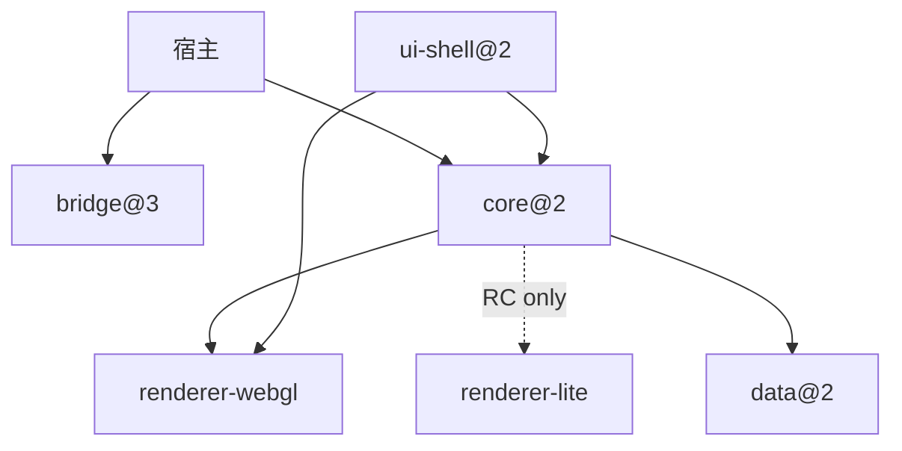
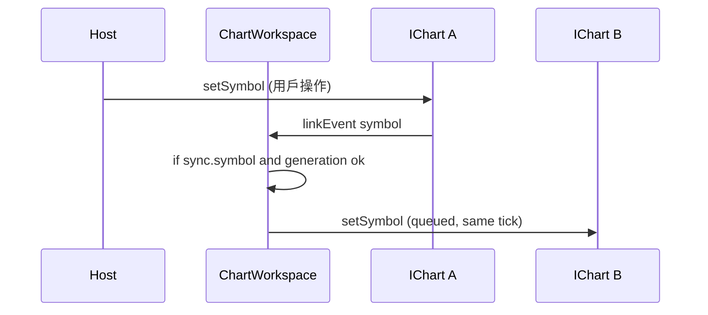
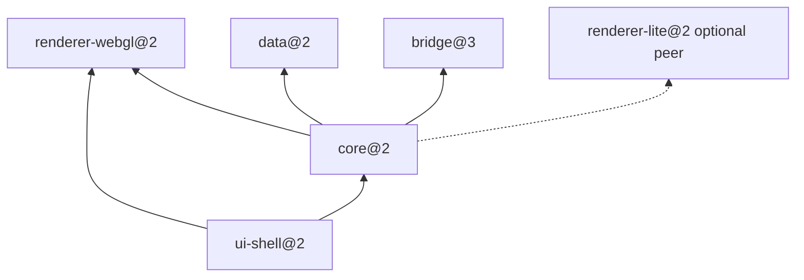
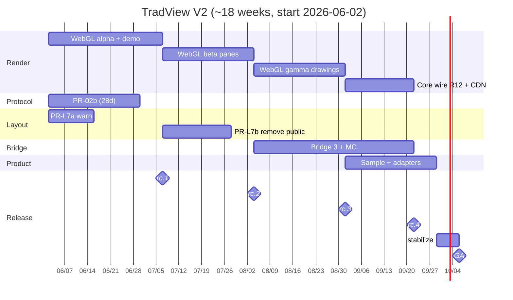
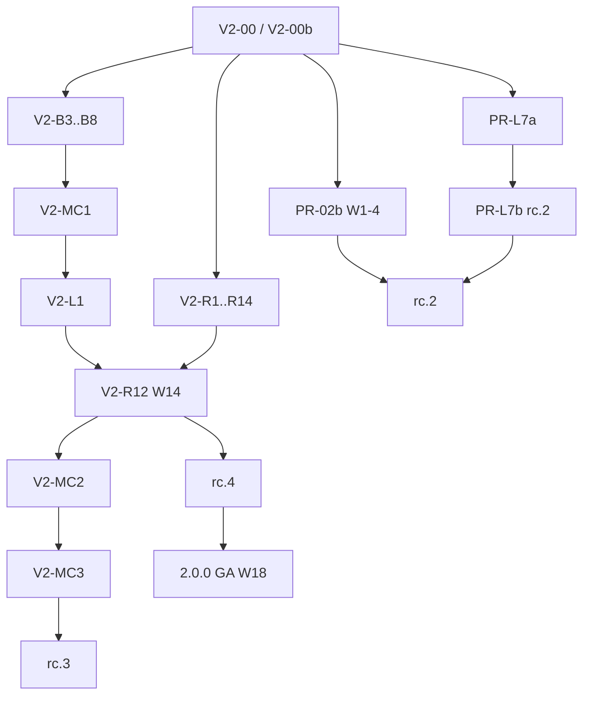

# TradView V2 — 設計文件

| 欄位 | 值 |
|------|-----|
| 版本 | **v2.0-spec-draft-r1**（post design-review） |
| 狀態 | **Draft** |
| 作者 | 架構組 |
| 最後更新 | 2026-06-04 |
| 基線 | **v1.1.1**（`@coderyo/core@1.1.1`、`@coderyo/ui-shell@1.1.1`、`@coderyo/bridge@2.0.0` schema 2） |
| 目標 GA | **`@coderyo/*@2.0.0`** + **`@coderyo/bridge@3.0.0`** + **`TRADVIEW_API_VERSION = 2`** |
| 工期 | **~18 週**（**2026-06-02 W1 → 2026-10-06 W18 GA**）；分階段 RC；**選項 C 為預設計畫**（見 §15、§16） |

**前置文件**：[`DESIGN.md`](./DESIGN.md)、[`LAYER-COMPOSITOR-PLAN.md`](./LAYER-COMPOSITOR-PLAN.md)、[`ADR-bridge-layer-sync.md`](./ADR-bridge-layer-sync.md)、[`API-FREEZE.md`](./API-FREEZE.md)、[`MIGRATION-bridge-2.md`](./MIGRATION-bridge-2.md)

---

## 1. Overview（總覽）

**TradView V2** 在 v1.1.x 已交付的資料垂直切片 + TV 殼層 + Layer Compositor v2 之上，完成五項北極星與三項 V2 擴充，並以 semver major 固化公開契約。

### 1.1 北極星（全部納入 V2 GA — 選項 C）

| # | 項目 | V2 交付定義 |
|---|------|-------------|
| NS-1 | **`@coderyo/renderer-webgl`** | **`phase_full`**：主圖 + 量 + 指標 + 繪圖 overlay；**非** LWC-primary |
| NS-2 | **PR-L7** | 移除 v1 **12×12 grid** 公開面；compositor v2 **唯一公開版面模型** |
| NS-3 | **PR-02b** | WS Protobuf + REST Envelope；JSON 語義 golden |
| NS-4 | **Bridge schema 3** | 多圖表 + 事件演進；GA **hard cut** schema 2 |
| NS-5 | **產品化** | **≥1 個**原生 sample（Android **或** iOS）可編譯 + SDK 敘事；RN/Flutter **文件級**（見 §4.8） |

### 1.2 V2 擴充（GA 範圍）

| # | 項目 | 說明 |
|---|------|------|
| V2-A | 同頁多圖 + 聯動 | `ChartWorkspace` + `LinkGroup` |
| V2-B | Pine-lite 加深 | **指標 builtins ≥ 18**（見 §7 計數口徑） |
| V2-C | 自託管 adapter | **≥1** 參考 adapter（csv-rest）；第二個可 tripwire 延後 |

### 1.3 明確延後（非 V2 GA blocker）

PR-19 CDN 授權；§10.4 pixel-perfect E2E；**第二原生平台**（若 tripwire 未觸發則仍交付雙平台）。

### 1.4 版本與破壞性政策

| 產物 | V1.1.1 | V2 GA |
|------|--------|-------|
| `@coderyo/core` 等（monorepo 同步） | `1.1.x` | **`2.0.0`** |
| `@coderyo/bridge` | `2.0.0`（schema 2） | **`3.0.0`**（schema 3）— **獨立 semver** |
| `TRADVIEW_API_VERSION` | `1` | **`2`** |
| `API-FREEZE` | 1.x | **`API-FREEZE-2.0.md`** |

**版本同步機制**：根目錄 `VERSION` 經 [`scripts/sync-versions.mjs`](../scripts/sync-versions.mjs) 寫入各 `package.json`，但 **`INDEPENDENT_VERSION_PACKAGES`** 含 `@coderyo/bridge`，**不會**被覆寫—故 bridge 可為 `3.0.0` 而 core 為 `2.0.0`。

### 1.5 整合方版本矩陣（npm / Bridge / Embed API）

| npm 套件 | 典型版本 @ GA | `bridgeSchemaVersion` | `TRADVIEW_API_VERSION` | 備註 |
|----------|---------------|------------------------|-------------------------|------|
| `@coderyo/core` | `2.0.0` | — | **2**（`chart.ready`） | 必須搭配 `renderer-webgl@2` |
| `@coderyo/ui-shell` | `2.0.0` | — | — | **peer** `core@2`；**不得**被 core 靜態 import |
| `@coderyo/bridge` | **`3.0.0`** | **3** | — | **禁止** `bridge@2` + `core@2` @ GA |
| `@coderyo/data` | `2.0.0` | — | — | v1.1 codec 可選 |
| `@coderyo/renderer-webgl` | `2.0.0` | — | — | core 硬依賴 @ GA |
| `@coderyo/renderer-lite` | `2.0.0` | — | — | optional peer；`features.renderer:'lite'` 僅 RC |
| `tradview.min.js`（CDN） | `2.0.0` 標籤 | **3** | **2** | 單一 UMD 內嵌 bridge+core；**不**單獨發 bridge CDN |

**`chart.ready` 範例（GA）**：

```json
{
  "type": "chart.ready",
  "payload": {
    "chartId": "main",
    "apiVersion": 2,
    "bridgeSchemaVersion": 3,
    "workspaceId": "default",
    "charts": [{ "chartId": "main", "symbol": "BINANCE:BTCUSDT", "interval": "1h" }]
  }
}
```

**錯誤組合 @ GA**：

| 組合 | 結果 |
|------|------|
| `core@2` + `bridge@2` | Bridge inbound → `chart.error` **`UNSUPPORTED_BRIDGE_SCHEMA`** |
| schema 2 `host.setSymbol`（無 `chartId`） | **`MISSING_CHART_ID`**（schema 3 全族要求） |
| `core@1` + `bridge@3` | 未支援；文件僅保證 **core 2 + bridge 3** |

**GA `package.json` 範例**：

```json
{
  "dependencies": {
    "@coderyo/core": "^2.0.0",
    "@coderyo/ui-shell": "^2.0.0",
    "@coderyo/data": "^2.0.0",
    "@coderyo/bridge": "^3.0.0",
    "@coderyo/renderer-webgl": "^2.0.0"
  }
}
```

---

## 2. Background（背景與現狀）

### 2.1 v1.1.1 已具備能力（實作核對）

| 能力 | 套件 / 路徑 | 備註 |
|------|-------------|------|
| 主圖 + 量 + 指標 | `renderer-lite` → `PaneOrchestrator` | N×LWC + `TimeScaleBusRegistry`（~970 LOC） |
| 圖層 Compositor | `ui-shell/layer/*` | Playground **`layerCompositorManaged: true`**（`apps/playground/src/main.ts`） |
| v1 grid | `layout-schema.ts`、`chart-layout.ts` | **仍公開**；`mountChartLayout` 在 `layerCompositorManaged !== true` 時仍走 `createLayoutGrid` |
| WebGL | `renderer-webgl` | **`phase_alpha` landed**（V2-R1–R4b）：主圖+量；`webgl-demo.html`；core 未接線 |
| 協議 | `@coderyo/data` | JSON + **`proto/tradview.proto`**（PR-02b-1）；WS codec 未接 |
| Bridge | `bridge@2.0.0` | `BRIDGE_SCHEMA_VERSION = 2` |
| Pine-lite | `pine-lite/builtins.ts` | **7 指標 builtins** + **7 series 識別子**（見 §7） |
| CDN / LWC gate | `check-cdn-size.mjs` / `check-lwc-size.mjs` | 400 KB / 180 KB |
| `core` 依賴 | `packages/core/package.json` | **`renderer-lite` only**；無 `renderer-webgl`、**無** `ui-shell` |

> **Playground** 為 compositor-only；**npm 整合方**仍可使用 grid 路徑直至 PR-L7 rc.2。

### 2.2 為何 V2 現在啟動

（同前稿：LWC 多實例觸頂、雙版面成本、宿主要多圖、後端要 Protobuf。）

---

## 3. Goals / Non-Goals

### 3.1 Goals

| ID | 目標 | 驗收 |
|----|------|------|
| G2-1 | WebGL `phase_full` | `features.renderer: 'webgl'` @ GA |
| G2-2 | 單一公開版面 | 無 grid 公開 API；`layerCompositorManaged: true` 為文件推薦 |
| G2-3 | 協議 v1.1 | PR-02b golden；**GA 整合方仍預設 JSON**（KD-5） |
| G2-4 | Bridge 3 + 多圖 | `docs/bridge-schema-3.md` + contract tests |
| G2-5 | 多圖聯動 | `ChartWorkspace` API + smoke test |
| G2-6 | Pine 加深 | **≥18 指標 builtins**（§7） |
| G2-7 | adapter | csv-rest @ GA；postgres-ws tripwire 可延 |
| G2-8 | 產品化 | **1 原生 sample CI 編譯** + `SDK.md` |
| G2-9 | API 凍結 | `API-FREEZE-2.0.md` @ rc.4 候選 |
| G2-10 | Bundle | CDN ≤ **400 KB**；階段預算 §8 |

---

## 4. Proposed Design（提案設計）

### 4.1 V2 邏輯架構



**依賴規則（§5.2）**：`ui-shell` → `core`（types/runtime）；**禁止** `core` import `ui-shell`。多圖殼層槽位在 `ui-shell`；workspace 狀態在 `core`。

### 4.2 渲染替換策略（`phase_full`）

`PaneOrchestrator` 行為遷移至 `WebGLPaneOrchestrator`；**必須移植清單**見 **附錄 A**（對照 `chart-controller.ts` 與 `pane-orchestrator.ts`）。

| 階段 | PR | 行為 |
|------|-----|------|
| `phase_stub` | PR-22 ✓ | no-op |
| `phase_alpha` | V2-R1–R4, **V2-R4b** | 主圖+量；**獨立 demo**（不接 core） |
| `phase_beta` | V2-R5–R8 | 指標窗 + LOD |
| `phase_gamma` | V2-R9–R11 | 繪圖 |
| `phase_full` | **V2-R12 @ W14**、R13–R14 @ W15 | core 接線；CDN 去 LWC |

**RC 與 Playground 邊界**：

| 里程碑 | Playground / core |
|--------|-------------------|
| **rc.1** | **`apps/playground/webgl-demo.html`**（V2-R4b）；**不**要求 `createChart` + webgl |
| **rc.2** | 可選 `?renderer=webgl` 實驗旗標（仍預設 lite） |
| **rc.4** | Playground 預設 `features.renderer: 'webgl'` |
| **GA** | `createChart` 預設 webgl；lite 僅顯式 flag |

#### `ChartFeatures` 增量（v1.1.1 → v2）

| 欄位 | v1.1.1 | rc.1 | rc.4 | GA |
|------|--------|------|------|-----|
| `renderer` | *無* | *無*（用 demo 路由） | `'lite'\|'webgl'`，預設 `lite` | 預設 **`webgl`** |
| `protobuf` | `false`（預設） | `false`，**codec 已接線（opt-in）** — `features.protobuf` + `capabilities.encoding` 含 `protobuf` 時 WS `tradview-protobuf` | opt-in | `false`（文件建議新整合方開啟） |
| `debugWebGL` | *無* | `false` | `false` | `false`；`true` 打開 shader 日誌 |
| `telemetry` 擴充 | 通用 | +`renderer.backend` | +`webgl.initMs` | +`draw.callCount` |

```typescript
type RendererBackend = 'webgl' | 'lite';

interface ChartFeatures {
  renderer?: RendererBackend;
  debugWebGL?: boolean;
  protobuf?: boolean;
  // …既有 v1 欄位不變
}
```

### 4.3 版面：PR-L7（分三期）

| 階段 | 版本 | 動作 |
|------|------|------|
| **1.1.x 末** | `1.1.2` deprecation | `createLayoutGrid` 等標 `@deprecated`；runtime **`console.warn`**（PR-L7a） |
| **rc.1** | `2.0.0-rc.1` | 文件 + warn；Playground 已 compositor-only |
| **rc.2** | PR-L7b | 公開 API 刪除；`layoutSchemaToPreset` → **`@coderyo/ui-shell/migrate`** |
| **GA** | `2.0.0` | `mountChartLayout` **要求** `layerCompositorManaged: true`（否則 throw 或 warn+空殼） |

`mountChartLayout` grid 分支（`chart-layout.ts`）在 rc.2 移除或改為呼叫 migrate 助手。

### 4.4 協議：PR-02b（W1–W4 合併，對齊 rc.2）

**時程**：與 Render α **並行**；**28 天**（W1–W4），目標 **2026-06-29** 合併—**早於 rc.1**，但 **rc.1 不承諾** Protobuf 可用。

| 子交付 | 週次 | 內容 |
|--------|------|------|
| PR-02b-1 | W1–W2 | `.proto` + REST Envelope 型別 + JSON fixture |
| PR-02b-2 | W3–W4 | WS codec + mock golden + `ChartFeatures.protobuf` 接線 |

#### REST Envelope（v1.1 強制）

```json
{
  "version": "1.1",
  "type": "history.response",
  "id": "req-uuid",
  "ok": true,
  "data": { "bars": [{ "t": 1718000000000, "o": 1, "h": 2, "l": 0.5, "c": 1.5, "v": 100 }] }
}
```

錯誤體：`ok: false`, `error: { "code": "SYMBOL_NOT_FOUND", "message": "…" }`。

#### WS Protobuf（fixture 摘要）

- Subprotocol：`tradview-protobuf`
- 第一幀仍為 **Envelope 語義** 的 `subscribe`；binary 為 `tradview.ws.Envelope`（見 `packages/data/proto/tradview.proto`）
- Golden：同一 `subscribe` JSON 與 proto **byte 長度固定** 測試（`proto-golden.test.ts`）

`capabilities.encoding` @ v2 文件建議：`['json','protobuf']`；**預設行為仍 json**（KD-5；OQ-V2-4 關閉）。

### 4.5 Bridge schema 3（可實作契約）

**規格正文**：[`docs/bridge-schema-3.md`](./bridge-schema-3.md)（**V2-00b** 骨架，rc.1 前 `.md` + 測試骨架）。  
**型別源**：`packages/bridge/src/schema3-types.ts`（V2-B3）。

#### `chart.ready`（schema 3）

| 欄位 | 必填 | 型別 |
|------|------|------|
| `chartId` | ✓ | `string` |
| `apiVersion` | ✓ | `2` |
| `bridgeSchemaVersion` | ✓ | `3` |
| `workspaceId` | ✓ | `string` |
| `charts` | ✓ | `ChartSummary[]` |
| `layerApi` | 可選 | 同 schema 2 `LAYER_API_READY`（preset v2） |

`ChartSummary`: `{ chartId, symbol?, interval?, active? }`

#### Inbound `host.workspace.*`（新增）

| type | payload 必填 | 說明 |
|------|--------------|------|
| `host.workspace.createChart` | `chartId`, `containerId` | 宿主提供 WebView 內 DOM id |
| `host.workspace.destroyChart` | `chartId` | |
| `host.workspace.setLinkGroup` | `groupId`, `chartIds[]`, `sync` | 見 §4.6 |
| `host.workspace.setActiveChart` | `chartId` | 焦點圖 |

#### Inbound 既有 `host.*`（schema 3 變更）

**全部** 下列類型 **必須** `chartId`（schema 2 僅 `host.layer.*` 需要）：

`host.setSymbol`, `host.setInterval`, `host.setTheme`, `host.setShowGrid`, `host.fitContent`, `host.scrollToRealtime`, `host.setLogScale`, `host.setBarSpace`, `host.setVisibleRange`, `host.scrollToTimestamp`, `host.reloadHistory`, `host.setLocale`, `host.setFeatures`, `host.setIndicatorConfig`, `host.clearAllIndicators`, `host.clearAllDrawings`, `host.setDrawingTool`, `host.setChartPaneResizeFocus`, `host.resize`, `host.destroy`, **以及** 全部 `host.layer.*`。

#### Outbound（新增）

| type | payload |
|------|---------|
| `chart.workspaceReady` | `{ workspaceId, charts[] }` |
| `chart.focusChanged` | `{ chartId, previousChartId? }` |
| `chart.linkStateChanged` | `{ groupId, chartIds, sync }` |

#### 錯誤碼（schema 3）

| code | 何時 |
|------|------|
| `UNSUPPORTED_BRIDGE_SCHEMA` | inbound `bridgeSchemaVersion !== 3` @ GA |
| `MISSING_CHART_ID` | 任一 `host.*` 缺 `chartId` |
| `CHART_NOT_FOUND` | `chartId` 未註冊 |
| `STALE_PRESET_REVISION` | 保留（layer） |
| `INVALID_PANE` | 保留（layer） |

**測試**：`packages/bridge/tests/schema3-events.test.ts`（鏡像 `layer-events.schema2.test.ts`）。

**Hard cut @ GA**：見 KD-7；遷移結構複製 [`MIGRATION-bridge-2.md`](./MIGRATION-bridge-2.md)。

### 4.6 同頁多圖 + 聯動（V2-A）

#### TypeScript 契約（`packages/core/src/chart-workspace.ts`）

```typescript
interface ChartWorkspaceOptions {
  workspaceId?: string;
  dataProvider: DataProvider;
  defaultLinkGroupId?: string;
}

interface LinkSyncFlags {
  symbol?: boolean;
  interval?: boolean;
  visibleRange?: boolean;
  crosshair?: boolean;
}

interface LinkGroup {
  id: string;
  chartIds: readonly string[];
  sync: LinkSyncFlags;
  /** 單調遞增；防止重入 */
  generation: number;
}

interface ChartWorkspace {
  createChart(chartId: string, container: HTMLElement, opts?: CreateChartOptions): IChart;
  destroyChart(chartId: string): void;
  getChart(chartId: string): IChart | undefined;
  setLinkGroup(group: LinkGroup): void;
  /** 單執行緒 dispatch；來源 chart 為 master */
  applyLinkEvent(sourceChartId: string, event: LinkEvent): void;
}
```

**與 `TimeScaleBusRegistry`**：每 `IChart` **獨立** registry；`sync.visibleRange` 時透過 workspace **fan-out** `setVisibleRange`，**不** 共用 bus 實例。



#### PR 臨界路徑（修正環路）

```
V2-MC1 (workspace) → V2-L1 (compositor slots) → V2-R12 (core renderer) → V2-MC2 (link sync) → V2-MC3 (demo) → V2-MC4 (smoke)
```

**禁止** V2-L1 依賴 V2-MC2（已修正）。

### 4.7 自託管 adapter（V2-C）

```
examples/adapters/csv-rest/     # GA 必須
examples/adapters/postgres-ws/  # tripwire 可延至 2.0.1
```

### 4.8 產品化（NS-5）

| 產物 | GA 要求 |
|------|---------|
| `apps/sample-android` **或** `apps/sample-ios` | **至少一個** CI compile + Bridge 3 smoke |
| 另一平台 | **同 GA 若人力允許**；否則 **2.0.1**（非 C-min 預設削減） |
| RN / Flutter | **`EMBEDDING.md` + `SDK.md`**；**不** 新增 `sample-rn` repo（除非 OQ 重開） |

---

## 5. Module Architecture

### 5.1 Monorepo（摘要）

新增：`docs/bridge-schema-3.md`、`packages/bridge/src/schema3-types.ts`、`apps/playground/webgl-demo.html`、`apps/sample-android|ios`。

### 5.2 套件依賴（GA）



- **`core` 不得依賴 `ui-shell`**（現狀已滿足；V2-00 加 **arch-test**）。
- **`ui-shell` 依賴 `core`**：僅公開類型與 `createChart` 回調。

---

## 6. Data & Protocol

邏輯不變（`Bar.t` ms、`barSeq` string）。v2 **文件化** Envelope / proto（§4.4）；實作 PR-02b @ W4。

---

## 7. Pine-lite 加深（V2-B）

### 7.1 計數口徑

| 類別 | v1.1.1 數量 | V2 GA 目標 |
|------|-------------|------------|
| **指標 builtins**（`INDICATOR_BUILTINS`） | **7** | **≥18** |
| series 識別子（`close`…`hlc3`） | 7 | 7（不計入 18） |

### 7.2 分批交付

| RC | PR | 新增指標 builtins（累計） |
|----|-----|---------------------------|
| rc.2 | V2-PINE1 | +6 → 13 |
| rc.3 | V2-PINE2 | +5 + MACD/BB IR → 18 |

**依賴**：MACD/BB 繪製 **綁定** V2-R6（WebGL 指標窗）。

---

## 8. Bundle & Performance

| 階段 | PR | CDN gzip 累計上限（實驗性 `bundle/cdn-webgl`） |
|------|-----|-----------------------------------------------|
| R2 後 | V2-R2 | 基線 + **≤40 KB** |
| R8 後 | V2-R8 | + **≤40 KB** |
| R11 後 | V2-R11 | + **≤50 KB** |
| GA | V2-R14 | **≤400 KB**（正式 `tradview.min.js`） |

**超支裁減順序**（tripwire）：① MSDF 字體 → ② Pine worker 不進 CDN → ③ sample 資產 → ④ 延後 postgres adapter。

---

## 9. Observability

見 §4.2 `ChartFeatures` 表；`debugWebGL` @ GA 預設 `false`。

---

## 10. Feature Flags（RC）

| Flag / 腳本 | `VERSION` 1.1.x / 2.0.0-rc 前 | `2.0.0` / `2.0.0-rc.N` |
|-------------|-------------------------------|-------------------------|
| `features.renderer` | lite（Playground 用 **獨立 demo**） | **webgl** @ GA |
| `check:lwc-size` | **執行**（`pnpm check:rc`） | **跳過**（V2-00 `check-rc.mjs`） |
| `TRADVIEW_SKIP_LWC_SIZE=1` | 不存在 | 不存在（勿新增） |

**V2-00**：`check-rc.mjs` 在 `VERSION` 匹配 `^2\.0\.0(-rc\.\d+)?$` 時 **跳過** `check:lwc-size`（含 **rc.1–rc.4** 與 GA `2.0.0`）。`1.1.x` 線仍執行 LWC gate。

---

## 11. Risks

（同前稿；增 **工期** 緩解：§16 tripwire / 穩定週 W17–W18。）

---

## 12. Migration Guides

| 文件 | 建立 PR | 內容 |
|------|---------|------|
| `MIGRATION-2.0.md` | **V2-00b** 骨架 | npm、apiVersion、PR-L7 三期、renderer |
| `MIGRATION-bridge-3.md` | **V2-00b** | 結構同 `MIGRATION-bridge-2.md` |
| `API-FREEZE-2.0.md` | rc.4 候選 | 完整凍結 |
| ADR ×4 | V2-ADR-* | status: proposed → accepted |

**Gate**：`PR-L7b`、`V2-B7` **依賴** 對應 migration 章節 **非空**。

---

## 13. Rollout — RC（18 週，起算 2026-06-02）

| 週 | 日期（一） | 里程碑 |
|----|------------|--------|
| W1 | 06-02 | 開工 |
| W5 | **07-07** | **2.0.0-rc.1** |
| W9 | 08-04 | **2.0.0-rc.2** |
| W13 | 09-01 | **2.0.0-rc.3** |
| W16 | 09-22 | **2.0.0-rc.4** |
| W17–W18 | 09-29 ~ 10-06 | **穩定化**（僅 bugfix/docs） |
| W18 | **10-06** | **2.0.0 GA** |



### RC 對照表（與 PR 驗收對齊）

| RC | 日期 | 週 | 必須可用 | **不** 承諾 |
|----|------|-----|----------|-------------|
| **rc.1** | 07-07 | W5 | WebGL **獨立 demo**（R4+R4b）；PR-L7a **warn**；PR-02b **spec/proto 合併或 W4 落地** | Playground `createChart` webgl；Protobuf **生產**；grid 刪除 |
| **rc.2** | 08-04 | W9 | WebGL **指標窗**；**PR-02b 完整 codec**；PR-L7b；Pine +6；csv-rest adapter | 繪圖；Bridge 3；多圖 |
| **rc.3** | 09-01 | W13 | WebGL **繪圖**；bridge **3.0.0-rc**；多圖 β；Pine →18 | schema 3 hard cut |
| **rc.4** | 09-22 | W16 | **R12–R14 已合**；Playground 預設 webgl；**1 個** native sample；FREEZE 候選 | — |
| **GA** | 10-06 | W18 | phase_full；`apiVersion=2`；bridge@3 hard cut | lite 非預設 |

**關鍵路徑**：Render R12 @ **W14**（在 rc.4 **之前**），避免 rc.4→GA 兩週內塞入接線+CDN+freeze。

---

## 15. Alternatives Considered（V2）

| 選項 | 摘要 | 未採用原因 |
|------|------|------------|
| **A — 範圍優先（~12 週）** | WebGL 主圖+量；Bridge 3；延後繪圖/多圖/雙 sample | 與 **使用者定案 C** 衝突 |
| **B — 漸進渲染（LWC-primary）** | 保留 LWC；WebGL 僅主圖 | 無法達 **phase_full**；N×LWC 債務延續 |
| **C — 全北極星 ~18 週（預設）** | 本文件 | **使用者 FINAL** |
| Bridge **runtime 雙 schema** | schema 2/3 並存適配層 | 維護成本高；v1 已 hard cut schema 2 先例 |
| PR-L7 **僅 deprecated 至 2.x 末** | grid 保留至 3.0 | 雙模型成本；整合方困惑 |
| Protobuf **預設 on** | GA 強制 proto | 後端遷移成本高；**JSON 永久並行** |
| **C-min（應急）** | 見 §16 | **非預設**；僅 tripwire 觸發 |

---

## 16. Capacity Assumptions & Tripwires（選項 C 可執行性）

### 16.1 人力假設（最低）

| 軌道 | FTE | 週期 |
|------|-----|------|
| Render（WebGL） | **2.0** | W1–W15 |
| Protocol + Data | **0.75** | W1–W4 重；之後 0.25 |
| Bridge + core 多圖 | **1.0** | W9–W16 |
| ui-shell + 產品化 | **0.75** | W5–W16 |
| **合計** | **~4.5 FTE** | 18 週 |

少於 **4 FTE** 時不改北極星，改觸發 **§16.3 tripwire**（日程右移 2–4 週仍屬 C，非默認 C-min）。

### 16.2 臨界路徑（日曆）

```
PR-02b (W4) ∥ R1–R4b (W5 rc.1) → R5–R8 (W9 rc.2) → R9–R11 (W13 rc.3)
→ R12 (W14) → R13–R14 (W15) → rc.4 (W16) → stabilize (W17–18) → GA
```

### 16.3 Tripwires（**不** 自動改為 C-min）

| 觸發條件 | 動作（仍屬 C） | 若仍不足 |
|----------|----------------|----------|
| W9 指標 WebGL 未達標 | 繪圖延後 rc.3；多圖延後 rc.4 | 日程 +2 週 |
| W13 繪圖未達標 | GA 仍 **phase_full** 但 **縮繪圖工具子集**（保留趨勢線+水平線） | 記 ADR |
| W16 僅 1 個 sample 就緒 | GA **1 平台**；第二平台 **2.0.1** | 已納入 NS-5 |
| W15 CDN > 400KB | §8 裁減順序 | 阻擋 GA tag |
| W4 PR-02b 滑移 | rc.2 才交付 codec（**rc.1 已不承諾**） | — |

### 16.4 Contingency：C-min（**僅** 上述仍失敗且不得延週時）

| 可defer | 仍保留 @ GA |
|---------|-------------|
| postgres-ws adapter | csv-rest |
| 第二原生 sample | 1 平台 + SDK |
| Pine 18→13 | WebGL phase_full |
| — | **禁止** defer：WebGL phase_full、PR-L7、PR-02b、Bridge 3 hard cut |

---

## Key Decisions（含拒絕項摘要）

| # | 決策 | 選擇 | 理由 | 拒絕的替代 |
|---|------|------|------|------------|
| KD-1 | 發布策略 | **C** ~18 週 RC | 使用者 FINAL | A 砍範圍；B LWC-primary |
| KD-2 | 渲染 | WebGL **phase_full** | NS-1 | 漸進 LWC |
| KD-3 | LWC | RC fallback only | 降維護 | GA 長期雙軌 |
| KD-4 | 版面 | PR-L7 三期 | 可遷移 | 保留 grid 至 2.x 末 |
| KD-5 | 協議 | Proto+JSON 並行；**預設 JSON** | 相容 | Proto default-on |
| KD-6 | Bridge semver | **3.0.0** 獨立 | 破壞面隔離 | 與 core 同 2.0.0 |
| KD-7 | Bridge 過渡 | **hard cut** | 與 schema 2 一致 | runtime 雙 schema |
| KD-8 | Embed API | **apiVersion 2** | 語義變更 | 維持 1 |
| KD-9 | 多圖 | Workspace+LinkGroup | 宿主控制 | preset 全域同步 |
| KD-10 | Pine | ≥18 **指標** builtins | 可驗收 | v5 相容 |
| KD-11 | Bundle | 400KB；廢 LWC gate | — | 380KB 硬門檻 |
| KD-12 | 延後 | PR-19、pixel E2E | — | — |
| KD-13 | ADR | 四項 + migration gate | 審計 | — |
| KD-14 | 產品化 | **≥1** native + SDK | NS-5 可驗收 | 雙平台硬門檻 |
| KD-15 | CDN UMD | **`createChart` only**；workspace **npm** | 控制 UMD 面積 | `TradView.createWorkspace` @ GA（**OQ-V2-3 關閉**） |

---

## PR Plan（修訂摘要 — 完整 45 PR）

> DAG 已修正；rc 驗收與 §13 對齊。新增：**V2-00b**、**V2-R4b**、**PR-L7a**、**PR-02b 分期**。

### 關鍵 PR 變更（相對初稿）

| PR | 變更 |
|----|------|
| **V2-00** | `check-rc` 跳過 `lwc-size`（2.0.0-rc+）；arch-test 禁止 core→shell |
| **V2-00b** | migration 骨架 + `bridge-schema-3.md` + ADR stubs **@ rc.1 前** |
| **V2-R2** | 驗收 **移除** Playground createChart；改 perf bench |
| **V2-R4b** | `playground/webgl-demo.html` 獨立路由 |
| **V2-R12** | 目標 **W14**（rc.4 前） |
| **PR-02b** | W1–W4（28d）；rc.2 完整 codec |
| **PR-L7a/b** | warn → rc.2 刪公開 |
| **V2-L1** | 依賴 **V2-MC1**（非 MC2） |
| **V2-MC*** | MC1→L1→R12→MC2→MC3→MC4 |
| **V2-PROD** | GA **≥1** 平台 |

**PR 合計**：**45**（+2：V2-00b、V2-R4b；PR-L7 拆 a）

### 並行軌 DAG（修正）



（其餘 PR 條目同初稿，依上表修正驗收與依賴。）

---

## Open Questions（僅真未知）

| ID | 問題 | 決策時點 |
|----|------|----------|
| OQ-V2-1 | WebGL 文字：MSDF vs canvas 紋理 | V2-R9 前（W11） |
| OQ-V2-2 | Android WebView 最低 API / GPU 黑名單 | rc.3 真機 |
| ~~OQ-V2-3~~ | ~~CDN createWorkspace~~ | **已關閉 → KD-15** |
| OQ-V2-4 | 新整合方文件是否 **推薦** proto | rc.2 文件；**預設仍 false** |

---

## 附錄 A — `PaneOrchestrator` → WebGL 必須移植清單

| 行為 | v1 位置 | GA 驗收 |
|------|---------|---------|
| `TimeScaleBusRegistry` + ms `logicalRange` | `time-scale-bus-registry.ts` | 多圖 **每 chart 獨立** |
| prepend `compensatePrependOnRegistry` | `time-scale-prepend.ts` | 單測移植 |
| `lodDecimateBars` | orchestrator + series | 指標/主圖 LOD |
| `isLayeredPaneMount` / `volumeMount` | orchestrator | compositor P2 |
| `shouldResizeChartPane` + resize focus | orchestrator | Bridge `setChartPaneResizeFocus` |
| 指標窗 `IndicatorPaneStack` + 增量 `series.update` | `indicator-panes.ts` | MACD/RSI/KDJ |
| `BarSmoothAnimator` | orchestrator | `smoothPriceUpdate` feature |
| gap / whitespace | orchestrator | `gaps.whitespace` |
| log scale | orchestrator | `setLogScale` |
| crosshair payload | orchestrator | Bridge `chart.crosshair` |
| Pine plot lines overlay | orchestrator | pine-lite IR |

**GA gate**：`packages/renderer-webgl/tests/port-parity.test.ts` 對照 lite fixture；`packages/core/tests/chart-controller.webgl.test.ts`。

---

## 14. References

| 文件 | 說明 |
|------|------|
| [DESIGN.md](./DESIGN.md) | v1 §8.11、§10.4 |
| [MIGRATION-bridge-2.md](./MIGRATION-bridge-2.md) | bridge-3 遷移模板 |
| [bridge-schema-3.md](./bridge-schema-3.md) | schema 3 契約（V2-00b 建立） |
| `scripts/sync-versions.mjs` | `INDEPENDENT_VERSION_PACKAGES` |

---

*文件結束 — TradView V2 Draft r1（design-review 修訂）*