# TradView — 設計文件

| 欄位 | 值 |
|------|-----|
| 版本 | **v1.0-spec**（全部待決項已關閉，可進入實作） |
| 狀態 | **Approved for implementation** |
| 作者 | 架構組 |
| 最後更新 | 2026-06-03 |
| 倉庫 | [CodeRyoStudio/tradview](https://github.com/CodeRyoStudio/tradview) |

---

## 1. Overview（總覽）

**TradView** 是一套可嵌入的 K 線圖表 **元件框架**（非完整交易終端），目標在視覺與互動上對齊 TradingView 體驗，但 **資料與行情完全由整合方自備**（不接 TradingView Widget/Data）。

### 交付形態

| 通道 | 說明 |
|------|------|
| npm | `@coderyo/core` 等套件，ESM + 型別定義 |
| CDN | `tradview.min.js` UMD/IIFE，全域 `TradView.createChart` |
| 授權 | **雙軌**：`@coderyo/core` 等基礎包 **MIT 開源**；`@coderyo/ui-shell`、`@coderyo/drawings` **私有商業授權** |

### 多平台策略

同一套 **H5 bundle** 經 WebView 載入；原生 App 透過 `BridgeAdapter`（`postMessage`）與圖表通訊。

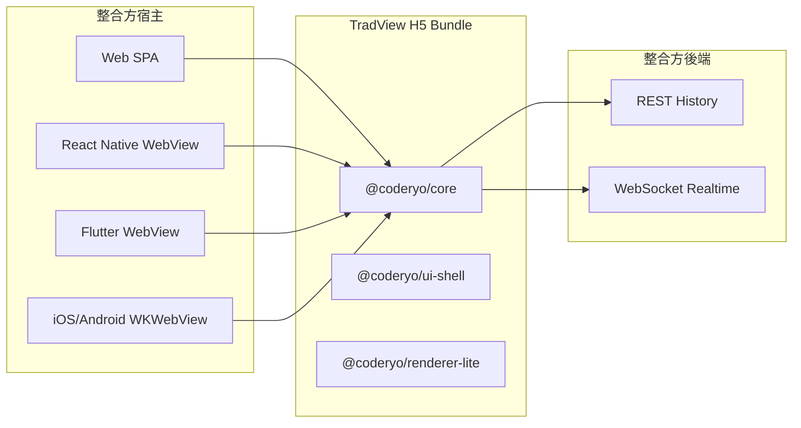

---

## 2. Background（背景）

- 市場需要 **TradingView 級 UX** 的圖表，但受授權、資料源、合規限制，無法依賴官方 Widget。
- 行動端與桌面端希望 **一套前端資產** 降低維護成本 → WebView + 同一 bundle。
- **產品優先級（對外驗收）**：**A 完整 UI 殼層 + 互動** > **B 資料層 + 協議** > 繪圖（可略晚）。
- **工程實作順序（刻意與 A>B 不同）**：**B 垂直切片先通**（協議 → DataProvider → BarStore → 渲染 → 互動），再於 M2 交付 **A 完整 TV 殼層**；無資料則 UI 無法驗證，此為 **有文件記載的 intentional reorder**。
- **M1 展示目標**：B + **Minimal Chart Slice**（主圖+量+頂部週期列 stub，見 PR-06b）；**M2** 才為完整 A。
- 渲染採 **混合路線**：v1 主路徑為 **Canvas 2D（Lightweight Charts）**，非 WebGL；繪圖 overlay 預設 **Canvas**（Pixi 為可選 POC）；v2 自研 **WebGL**（`@coderyo/renderer-webgl`）。

---

## 3. Goals / Non-Goals（目標與非目標）

### 3.1 Goals（v1）

| # | 目標 | 可驗收標準 |
|---|------|------------|
| G1 | 可嵌入 K 線主圖 + 成交量副圖 | 單容器 `createChart`，支援 pan/zoom/crosshair |
| G2 | 多週期切換 | 1m/5m/15m/1h/4h/1D/1W 等可配置 |
| G3 | 內建指標 | MA、MACD、RSI、KDJ、Vol MA；主圖疊加 + 獨立指標窗格 |
| G4 | Pine-lite 骨架（**compile-only，預設關閉**） | 解析 + 型別檢查 + IR；**無** v1 使用者編輯器；執行/Worker 為 **1.0.0-rc 可選**（見 §9、PR-18a–c） |
| G5 | 繪圖工具 v1 | 趨勢線、水平/垂直線、矩形、斐波那契、文字；`localStorage` 持久化 |
| G6 | 完整 TV 式版面 | 左工具列、頂部週期列、價格軸、時間軸、指標面板 |
| G7 | 主題 / i18n / 快捷鍵 | dark/light；可擴充語言包；v1 鍵盤快捷鍵 |
| G8 | 資料抽象 | `DataProvider` 統一分頁；`SymbolResolver` 由整合方實作 |
| G9 | 認證鉤子 | `onConnect`、`getHeaders` 等，閘道由整合方處理 |
| G10 | WebView Bridge | `BridgeAdapter` + `postMessage` 契約文件化 |
| G11 | 全螢幕 / 截圖 | TopBar 全螢幕；`chart.exportImage()` 導出 PNG |

### 3.2 Non-Goals（v1 明確不做）

| 項目 | 說明 |
|------|------|
| 多圖分割版面 | 單圖單容器；v2+ 再評估 |
| TradingView 資料 / Widget | 完全自備資料 |
| 下單、持倉、帳戶 | 非交易終端 |
| 伺服器端 Pine 編譯 | v1 僅瀏覽器本地 |
| 框架綁定 React/Vue | TypeScript 原生，宿主自行封裝 |
| 市場品種強制枚舉 | 符號由使用者資料定義 |

---

## 4. Proposed Design（提案設計）

### 4.1 邏輯分層

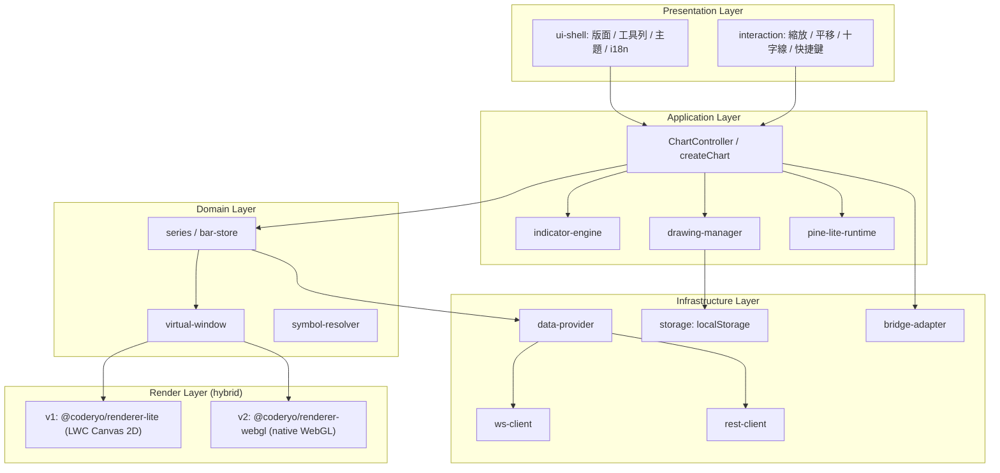

### 4.2 核心資料流

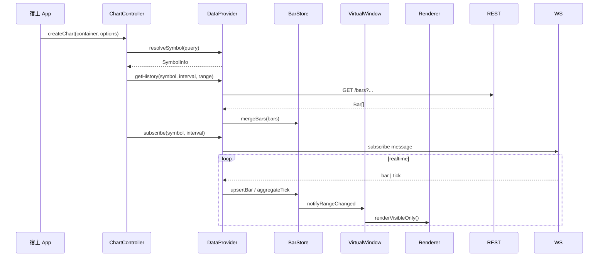

### 4.3 時間與座標約定

| 項目 | 約定 |
|------|------|
| 時間戳 | **毫秒 UTC**（`number`，`t` 欄位） |
| OHLCV | `o,h,l,c,v`；`v` 可選（無量則副圖隱藏或顯示空狀態） |
| 價格精度 | 由 `SymbolInfo.priceScale` / `minMove` 決定刻度格式化 |
| 主鍵空間 | **`t`（ms UTC）為唯一主鍵**；陣列索引僅為 **連續已載入段** 內的衍生視圖，禁止跨 trim/prepend 當穩定 ID |
| 可見窗 | 以 **`visibleFromMs` / `visibleToMs`** 定義；十字線、繪圖、Bridge 一律用 **time + price** |

---

## 5. Module Architecture（模組與 Monorepo 佈局）

**已決議**：**pnpm workspace + Turborepo**（不再評估 Nx/npm-only）。

```
tradview/
├── packages/
│   ├── core/                 # ChartController, 公開 API, 事件匯流排
│   ├── data/                 # DataProvider, REST/WS client, 協議型別
│   ├── series/               # BarStore, merge, gap 處理
│   ├── virtual-window/       # 可見窗演算法、LOD
│   ├── renderer-lite/        # v1 LWC Canvas 2D 適配 + PaneOrchestrator
│   ├── renderer-webgl/       # v2 自研 WebGL（初期空殼 + feature flag）
│   ├── renderer-native/      # （可併入 renderer-webgl，保留別名）
│   ├── indicators/           # MA, MACD, RSI, KDJ, Vol MA
│   ├── drawings/             # 繪圖模型、命中測試、持久化
│   ├── pine-lite/            # DSL parser, sandbox runtime
│   ├── interaction/          # zoom/pan/crosshair 手勢
│   ├── ui-shell/             # TV 版面 DOM 結構
│   ├── i18n/                 # 語言包插件
│   ├── bridge/               # BridgeAdapter, postMessage
│   └── cli-dev/              # 本地 demo、協議 mock server
├── apps/
│   ├── playground/           # 開發用完整 UI
│   └── docs-site/            # 協議與 API 文件站（可 v1.1）
├── tools/
│   ├── eslint-config/
│   └── tsconfig/
├── bundle/
│   └── cdn/                  # esbuild 打 UMD 產物
├── package.json
├── pnpm-workspace.yaml
└── turbo.json
```

### 5.1 套件依賴方向（僅允許向下依賴）

```
ui-shell → core → { series, virtual-window, indicators, drawings, pine-lite, interaction }
core → data → (protocol types)
series → virtual-window → renderer-lite | renderer-webgl
bridge → core (peer)
```

### 5.2 授權與發布邊界（已決議 OQ5）

| 套件 | 授權 | npm |
|------|------|-----|
| `core`, `data`, `series`, `virtual-window`, `renderer-lite`, `renderer-webgl`, `indicators`, `interaction`, `pine-lite`, `bridge`, `i18n` | **MIT** | 公開發布 |
| `ui-shell`, `drawings` | **UNLICENSED / 商業授權** | 發布至私有 registry 或與商業合約綁定 |
| CDN `tradview.min.js` | 聚合產物；含 ui-shell 時視為 **商業版** | 由授權金鑰或域名白名單解鎖（實作於 PR-19） |

### 5.3 建置產物

| 套件 | 輸出 |
|------|------|
| `@coderyo/core` | `dist/index.js` ESM + `.d.ts` |
| CDN | 單檔 `tradview.min.js`，externals 無（內聯必要依賴） |
| npm 發布 | **所有 `packages/*` 均可獨立發布**（`@coderyo/core`、`data`、`ui-shell`、`bridge`…）；CDN 仍為聚合 `tradview.min.js` |
| 授權標記 | 各包 `package.json` 的 `license` 欄位：`MIT`（開源包）或 `UNLICENSED`（ui-shell、drawings） |

---

## 6. Public TypeScript API（公開 API）

### 6.0 整合方優先（Integrator-first）

> **TradView 是可嵌入框架，不是獨立交易終端。** `apps/playground` 與 `createDemo*` 僅為**參考實作**，不得成為能力的唯一入口。

| 層級 | 套件 | 整合方如何控制 |
|------|------|----------------|
| **L0 圖表能力** | `@coderyo/core` — `createChart` / `IChart` / `ChartFeatures` | 程式呼叫；**預設最小**（無商品、無指標、無繪圖互動層、見 `DEFAULT_CHART_FEATURES`） |
| **L1 參考殼層** | `@coderyo/ui-shell` — `mountChartLayout` | 各 `show*` **預設 `false`**；每個 UI 行為經 **callback** 由宿主自行接線至 `IChart`（殼層不會自動綁 chart） |
| **L2 遠端宿主** | `@coderyo/bridge` | `host.*` 白名單應與 `IChart` 對齊（WebView / RN / Flutter） |
| **L3 展示** | `apps/playground`、CDN demo | 僅示範接線方式 |

**新功能流程（強制）：** ① 擴充 `IChart` 或 `ChartFeatures`（及必要時 Bridge `host.*`）→ ② 更新 [API.md](./API.md) → ③（可選）在 ui-shell 增加參考 UI → ④ Playground 接線範例。

**反模式：** 只在 Settings 面板、TopBar 或 Playground 實作，而 `IChart` 無對應方法（宿主無法用自己的 UI 觸發）。

**權威 API 清單：** 以 [API.md](./API.md) 與 `packages/core` 匯出型別為準；下方 §6.1 片段為概要，可能落後於 RC 實作。

#### 能力對照（v1）

| 能力 | `IChart` / `ChartFeatures` | Bridge `host.*` | 僅 ui-shell / Playground |
|------|---------------------------|-----------------|---------------------------|
| 商品、週期 | `setSymbol` / `setInterval` | `host.setSymbol` / `host.setInterval` | TopBar callback |
| 主題、網格、對數軸 | `setTheme` / `setShowGrid` / `setLogScale` | `host.setTheme` / `host.setShowGrid` / `host.setLogScale` | TopBar、Settings |
| 視窗、縮放 | `getVisibleRange` / `setBarSpace` / `setVisibleRange` / `scrollToTimestamp` | 對應 `host.*` | — |
| 指標參數 | `setIndicatorConfig` / `setFeatures.indicators` | **未覆蓋** | Settings 表單 |
| 清空指標、畫線 | `clearAllIndicators` / `clearAllDrawings` | **未覆蓋** | Settings 按鈕 |
| 繪圖 | `setDrawingTool`、`deleteSelectedDrawing` 等 | **未覆蓋** | LeftToolbar、右鍵選單 |
| 全螢幕、截圖 | `setFullscreen` / `exportImage` | **未覆蓋** | TopBar |
| Pine 腳本 | `setFeatures({ pineEnabled, pineScript })` | `host.setFeatures`（泛用 patch） | `mountPineEditorPanel`（Playground 掛載） |
| 主題 / i18n DOM | —（圖表內 `setTheme` / `setLocale`） | `host.setLocale` | `createThemeProvider` / `createI18nProvider`（可選注入 layout） |
| 指標窗格 × 關閉 | `setIndicatorConfig({ showMacd: false, … })` | **未覆蓋** | 窗格右上角按鈕 |
| 資料、認證 | `DataProvider` / `AuthHooks`（`@coderyo/data`） | — | — |

---

### 6.1 工廠與鏈式 API

```typescript
// @coderyo/core

export interface ChartOptions {
  apiVersion?: 1;           // embed API surface version; formal freeze at RC (PR-19)
  width?: number;
  height?: number;
  locale?: string;         // default 'zh-TW'（已決議）
  theme?: 'dark' | 'light';
  interval?: Interval; // default '1D'
  symbol?: string;       // default symbol id after resolver
  dataProvider: DataProvider;
  symbolResolver: SymbolResolver;
  bridge?: BridgeAdapter;
  auth?: AuthHooks;
  telemetry?: TelemetryHooks;
  storage?: StorageAdapter; // default localStorage
  renderer?: 'lite' | 'webgl'; // default 'lite'
  pineEnabled?: boolean;   // default false in v1.0.0
  /** @default 'lazy-left-only' — 見 §11.3 */
  fetchPolicy?: 'lazy-left-only' | 'fill-visible-holes';
  debug?: boolean;
}

export interface TelemetryHooks {
  onMetric?: (m: { name: string; value: number; tags?: Record<string, string> }) => void;
  onLog?: (level: 'trace' | 'info' | 'warn' | 'error', msg: string, ctx?: object) => void;
}

export interface IChart {
  setSymbol(symbol: string): IChart;
  setInterval(interval: Interval): IChart;
  setTheme(theme: 'dark' | 'light'): IChart;
  setLocale(locale: string): IChart;
  fitContent(): IChart;
  scrollToRealtime(): IChart;
  /** Resize chart; emits bridge `chart.resize` when dimensions change (§13.4) */
  resize(size?: { width?: number; height?: number }): IChart;
  /** 進入/退出全螢幕（容器元素）；TopBar 按鈕與 Bridge 共用 */
  setFullscreen(enabled: boolean): IChart;
  /** 導出當前圖表為 PNG Blob；TopBar 截圖按鈕觸發 */
  exportImage(opts?: { pixelRatio?: number }): Promise<Blob>;
  subscribeBars(handler: BarHandler): () => void;
  on(event: ChartEvent, handler: EventHandler): IChart;
  off(event: ChartEvent, handler: EventHandler): IChart;
  destroy(): void;
}

export function createChart(
  container: HTMLElement | string,
  options: ChartOptions
): IChart;
```

### 6.2 DataProvider

```typescript
// @coderyo/data

export type HistoryQuery =
  | { mode: 'range'; symbol: string; interval: Interval; from: number; to: number }
  | { mode: 'cursor'; symbol: string; interval: Interval; limit: number; cursor?: string }
  | { mode: 'loadMore'; symbol: string; interval: Interval; endTime: number; limit: number };

export interface Bar {
  t: number;      // ms UTC
  o: number;
  h: number;
  l: number;
  c: number;
  v?: number;
}

export interface DataProviderCapabilities {
  historyModes: Array<'range' | 'cursor' | 'loadMore'>;
  wsHistory?: boolean;
  symbolSearch?: boolean;
  realtimeModes: Array<'bar' | 'tick' | 'bar+tick'>;
  /** v1.0 僅 ['json']；v1.1 可含 'protobuf'（§8.11） */
  encoding?: Array<'json' | 'protobuf'>;
}

export interface Subscription {
  id: string;              // server-assigned subscriptionId from subscribe.ok
  clientRef: string;       // client-generated correlate id
  symbol: string;
  interval: Interval;
  channels: RealtimeChannel[];
  streamMode: RealtimeStreamMode;
}

export type RealtimeChannel = 'bar' | 'tick';
export type RealtimeStreamMode = 'bar' | 'tick' | 'bar+tick';

export interface SubscribeParams {
  symbol: string;
  interval: Interval;
  channels?: RealtimeChannel[];
  streamMode?: RealtimeStreamMode; // default 'bar'
}

/** Used when integrator omits getCapabilities (§6.2, §8.2) */
export const DEFAULT_DATA_PROVIDER_CAPABILITIES: DataProviderCapabilities = {
  historyModes: ['loadMore', 'range', 'cursor'],
  realtimeModes: ['bar'],
  wsHistory: false,
  symbolSearch: false,
};

export interface DataProvider {
  /** If omitted, framework uses DEFAULT_DATA_PROVIDER_CAPABILITIES */
  getCapabilities?(): Promise<DataProviderCapabilities>;
  getHistory(query: HistoryQuery): Promise<{ bars: Bar[]; nextCursor?: string; hasMore?: boolean }>;
  subscribe(params: SubscribeParams, handlers: RealtimeHandlers): Promise<Subscription>;
  unsubscribe(subscriptionId: string): Promise<void>;
  searchSymbols?(query: string): Promise<SymbolSearchHit[]>; // lightweight hits only
  requestWsHistory?(params: WsHistoryParams): Promise<Bar[]>;
}

// History dedup: at most one in-flight history op per (symbol, interval).
// If capabilities.wsHistory → use requestWsHistory; else REST getHistory. Never both in parallel.

export interface SymbolSearchHit {
  symbol: string;
  name: string;
  exchange?: string;
}

export interface RealtimeHandlers {
  onBar?: (bar: Bar, meta: { partial: boolean }) => void;
  onTick?: (tick: Tick) => void;
  onError?: (err: DataError) => void;
  onConnectionChange?: (state: ConnectionState) => void;
}
```

### 6.3 SymbolResolver

```typescript
export interface SymbolInfo {
  symbol: string;           // canonical id, e.g. "BINANCE:BTCUSDT"
  name: string;             // display
  exchange?: string;
  type?: 'crypto' | 'stock' | 'forex' | 'futures' | 'index' | string;
  priceScale: number;       // e.g. 100 for 2 decimals
  minMove: number;
  session?: string;         // integrator-defined
  timezone?: string;        // display only
}

export interface SymbolResolver {
  /** Source of truth for SymbolInfo fields (priceScale, session, etc.) */
  resolve(input: string): Promise<SymbolInfo>;
  normalize?(raw: string): string;
}

// Symbol discovery rule: searchSymbols → ids → resolve() enriches before chart load.
```

### 6.4 AuthHooks（僅框架鉤子）

```typescript
export interface AuthHooks {
  getHeaders?: () => Record<string, string> | Promise<Record<string, string>>;
  getQueryParams?: () => Record<string, string>;
  onConnect?: (transport: 'rest' | 'ws') => void | Promise<void>;
  onDisconnect?: () => void;
  /** Called on AUTH_FAILED / 401; see §8.3.1 re-auth state machine */
  refreshToken?: () => Promise<void>;
}
```

### 6.5 BridgeAdapter

```typescript
export interface BridgeAdapter {
  post(event: BridgeEvent): void;
  onMessage(handler: (msg: BridgeInbound) => void): () => void;
}

export type BridgeEvent =
  | { type: 'chart.ready'; payload: { chartId: string; bridgeSchemaVersion: 1; apiVersion: number } }
  | { type: 'chart.crosshair'; payload: CrosshairPayload }
  | { type: 'chart.interval'; payload: { interval: Interval } }
  | { type: 'chart.symbol'; payload: { symbol: string } }
  | { type: 'chart.visibleRange'; payload: { from: number; to: number } }
  | { type: 'chart.resize'; payload: { width: number; height: number } }
  | { type: 'chart.connectionChange'; payload: { state: ConnectionState } }
  | { type: 'chart.error'; payload: { code: string; message: string } }
  | { type: 'chart.destroyed'; payload: { chartId: string } };

export type BridgeInbound =
  | { type: 'host.setSymbol'; payload: { symbol: string } }
  | { type: 'host.setInterval'; payload: { interval: Interval } }
  | { type: 'host.setTheme'; payload: { theme: 'dark' | 'light' } }
  | { type: 'host.fitContent' }
  | { type: 'host.scrollToRealtime' }
  | { type: 'host.resize'; payload: { width?: number; height?: number } }
  | { type: 'host.destroy' };
```

### 6.6 事件（ChartEvent）

| 事件 | 觸發時機 |
|------|----------|
| `crosshairMove` | 十字線移動 |
| `visibleRangeChange` | 可見時間範圍變更 |
| `intervalChange` | 週期切換完成 |
| `symbolChange` | 品種切換完成 |
| `barUpdate` | 新 bar / 更新當前 bar |
| `drawingChange` | 繪圖增刪改 |
| `connectionChange` | WS 連線狀態 |
| `error` | 可恢復/不可恢復錯誤（`DataError`） |

### 6.7 連線狀態與資料錯誤型別

```typescript
export type ConnectionState =
  | 'connecting'
  | 'connected'
  | 'reconnecting'
  | 'disconnected'
  | 'failed';

export interface DataError {
  /** Aligns with REST `error.code` (§8.2) and WS §8.8 */
  code: string;
  message: string;
  recoverable: boolean;
  retryAfterMs?: number;
  refId?: string;
  transport?: 'rest' | 'ws';
}
```

| `ConnectionState` | 觸發 |
|-------------------|------|
| `connecting` | WS 連線建立中 |
| `connected` | `auth.ok` 或等同就緒 |
| `reconnecting` | 斷線後指數退避重試（§8.9） |
| `disconnected` | 主動 `destroy` 或 `onDisconnect` |
| `failed` | `AUTH_FAILED` 且 refresh 失敗；不再自動重連 |

| 常見 `DataError.code` | 來源 | `recoverable` |
|------------------------|------|---------------|
| `RATE_LIMITED` | REST 429 / WS busy | true |
| `INVALID_RANGE` | REST 400 | false |
| `AUTH_FAILED` | WS / REST 401 | false（除非 refresh 成功） |
| `SUBSCRIBE_TIMEOUT` | §8.4.1 | true |
| `UNKNOWN_SYMBOL` | WS / REST | false |
| `CONFIG_ERROR` | 客戶端：無 capabilities 且 probe 失敗 | false |

`RealtimeHandlers.onError` 與 `ChartEvent.error` 使用相同 `DataError` 形狀；Bridge `chart.error` 傳 `{ code, message }`（精簡）。

---

## 7. Data Model（資料模型）

### 7.1 BarStore（記憶體）

```typescript
interface BarStoreState {
  symbol: string;
  interval: Interval;
  generation: number;       // increments on symbol/interval change or full reset
  barsByTime: Map<number, Bar>; // primary store; key = bar open time t (ms UTC)
  sortedTimes: number[];    // ascending open times of loaded bars only
  loadedRanges: Array<{ fromMs: number; toMs: number }>; // may be non-contiguous
  lastBarRef: { t: number; partial: boolean; barSeq?: string };
  mutationQueue: Promise<void>; // serialize per-symbol mutations
}
```

**不變量（Invariants）**

1. **`t` 為 bar 的 open time**（見 §7.3）；同一 `(symbol, interval, t)` 最多一筆。
2. **十字線 / 繪圖 / Bridge** 只讀 `t`，不讀陣列 index。
3. **`loadedRanges` 以時間表示**；未載入區間不佔位、不插假 bar。
4. **記憶體裁剪** 不得刪除 `visibleFromMs` 左側至少 **`warmupBarCount`** 根實際 bar（§11.6），且不得刪除 `t ∈ [visibleFromMs, visibleToMs]`。

**`barSeq` 比較（協議型別為 `string`）**

```typescript
/** Decimal integer strings compared as bigint; opaque strings lexicographic */
function compareBarSeq(a: string, b: string): -1 | 0 | 1;
```

- JSON **禁止** 以 Number 傳遞 `barSeq`（>2⁵³−1 會失真）；PR-02 協議測試需覆蓋大整數字串。

**合併規則（含 `barSeq` 冪等）**

| 情境 | 規則 |
|------|------|
| 相同 `t`，REST vs WS | 若 WS 帶 `barSeq`，僅接受 **`compareBarSeq(incoming, existing) > 0`**；否則 **WS 優先於 REST** |
| `partial: true` | 更新當前 open bar 的 OHLCV；**不** 新增 `sortedTimes` 條目 |
| `partial: false` | 關閉當前 bar；下一根使用 **新 `t`**（見 §7.3） |
| `loadMore` prepend | 合併後 **重排 `sortedTimes`**；`generation` 不變；可見 `visibleFromMs` 不變 |
| 重複 `t` 來自 backfill + realtime | 以 `barSeq` 或 `sourcePriority: ws > rest` 去重 |

**並發：`loadMore` vs realtime**

- 所有寫入經 **`mutationQueue`** 序列化（per symbol+interval）。
- `loadMore` 進行中：realtime **仍入隊**，但 renderer 使用 **合併後單幀提交**（避免 flicker）。
- 切換 symbol/interval 時：**取消 in-flight `loadMore`/`getHistory`**（AbortController），`generation++`。

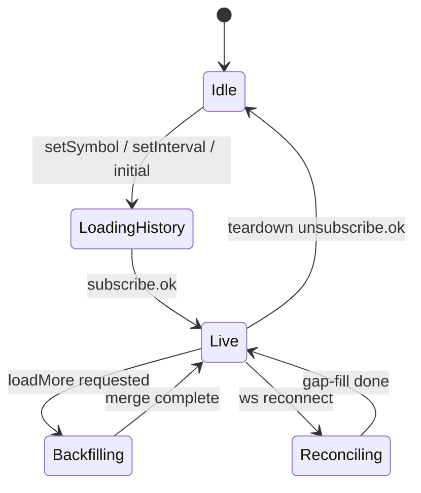

### 7.2 Tick 聚合與 `streamMode`

```typescript
interface Tick {
  t: number;   // event time ms UTC
  price: number;
  size?: number;
}
```

| `streamMode` | 行為 |
|--------------|------|
| `bar`（**預設**） | 忽略 `tick`；僅處理 `bar` |
| `tick` | 啟用 `TickAggregator`；忽略 `bar`（除非 `bar+tick`） |
| `bar+tick` | **`bar` 權威**；`tick` 僅在 **無 bar 推送的 2s 內** 用於聚合；收到 `bar` 後清空 aggregator 暫存 |

若 `channels` 含 `tick` 但 `streamMode` 為 `bar`，框架 **console.warn** 並忽略 tick。

**管線順序（與虛擬視窗 / LOD）**：`tick → TickAggregator → BarStore` →（指標讀 Store）→ `virtual-window` 選 **時間切片** → **LOD 僅在 render 副本**，不寫回 Store。

### 7.3 Bar open time、`partial` 關閉與 session

**Bar open time（規範）**

```
barOpenTime(eventMs, intervalMs) = floor(eventMs / intervalMs) * intervalMs  // UTC bucket
```

- **1m / 1h / 1D** 等均用 UTC bucket；**伺服器為權威**（推薦）。
- 若僅有 `tick`：由客戶端 `TickAggregator` 按上式合成；interval 邊界滾動時 **關閉** 上一根（`partial: false` 等價：寫入最終 OHLCV）。

**`partial` 生命週期**

| 角色 | 責任 |
|------|------|
| 伺服器推 `bar` | `partial: true` 更新進行中 bar；邊界滾動時推 `partial: false` 或新 `t` 的 bar |
| 客戶端聚合 | 邊界滾動時自動關閉並開新 bar |

**`SymbolInfo.session`（v1）**

- 僅用於 **日曆顯示** 與 **gap 標記**（session break 不強制切 bar，除非整合方在資料層插入 gap）。
- Gap：`sortedTimes` 相鄰差 > `intervalMs * 1.5` → `gap: true`；LWC 使用 **whitespace / 不連續資料**（§10.5）。

### 7.4 Symbol / Interval 切換

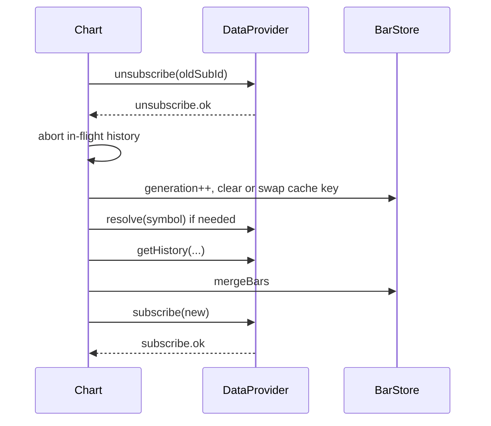

- **快取**：`BarStore` 以 `cacheKey = symbol|interval` 使用 **LRU，最多 5 個**；超出時淘汰最久未使用 key。
- **防抖**：`setSymbol`/`setInterval` 300ms debounce；快速連切只保留最後一次。
- **繪圖**：切換後載入 `tradview:drawings:{id}:{symbol}:{interval}`（§14）。

---

## 8. REST + WebSocket 協議規格（詳細）

> **版本**：`protocolVersion: "1.0"`  
> 所有訊息為 **JSON** 文字幀（v1）。時間戳皆 **毫秒 UTC**。

### 8.0 Interval 註冊表（規範）

`Interval` 為 **小寫數字 + 單位** 字串；**大小寫敏感**（禁止 `1H`，應為 `1h`）。

| Interval | `intervalMs` | 備註 |
|----------|--------------|------|
| `1m` | 60_000 | |
| `5m` | 300_000 | |
| `15m` | 900_000 | |
| `1h` | 3_600_000 | |
| `4h` | 14_400_000 | |
| `1D` | 86_400_000 | **日線例外用大寫 D** |
| `1W` | 604_800_000 | **週線例外用大寫 W** |

- `@coderyo/data` 匯出 `INTERVAL_REGISTRY`、`parseInterval(s): Interval`、`intervalMs(i)`；非法字串拋 `INVALID_INTERVAL`。
- UI `IntervalSelector` 自訂列表 **必須** 為上述註冊表子集或透過整合方擴展（擴展需在 `SymbolResolver` 側登記）。
- REST/WS **必須** 使用同一字串；否則 400 / `INVALID_INTERVAL`。

### 8.1 共通封包 Envelope

```json
{
  "v": "1.0",
  "id": "uuid-or-monotonic-id",
  "type": "message_type",
  "ts": 1710000000000,
  "payload": {}
}
```

| 欄位 | 型別 | 說明 |
|------|------|------|
| `v` | string | 協議版本 |
| `id` | string | 請求/回應關聯；伺服器推送可省略或由伺服器填 |
| `type` | string | 訊息類型 |
| `ts` | number | 訊息產生時間（ms） |
| `payload` | object | 內容 |

### 8.2 REST — 歷史 K 線

**版本標頭（與 WS Envelope 對齊）**

- 請求：`X-TradView-Protocol-Version: 1.0`
- 回應可選：`X-TradView-Protocol-Version: 1.0`
- **v1.0 REST**：body **扁平 JSON**（非 Envelope）。
- **v1.1 REST**：**強制 Envelope**（與 §8.1 同型）；請求/回應皆含 `v,type,payload`；`X-TradView-Protocol-Version: 1.1`。

**`GET /api/v1/bars`**

**`GET /api/v1/capabilities`**（建議實作；mock **必須**實作）

```json
{
  "historyModes": ["loadMore", "range", "cursor"],
  "realtimeModes": ["bar"],
  "wsHistory": false,
  "symbolSearch": true
}
```

**能力協商**

| 情境 | 行為 |
|------|------|
| 提供 `getCapabilities()` | 使用回傳值 |
| 未提供，但有 REST base URL | 嘗試 `GET /api/v1/capabilities`；失敗則使用 **`DEFAULT_DATA_PROVIDER_CAPABILITIES`**（§6.2）並 `telemetry` warn 一次 |
| 兩者皆無 | 使用 default；若首次 history 回 `INVALID_RANGE`，上拋 `DataError` code `CONFIG_ERROR` |

**History fallback 順序**（與 v0.2 相同）：

1. 若支援 `loadMore` → 虛擬視窗左/右/洞補載（§11.3）  
2. 否則若支援 `range` → `from/to`（**洞補載首選**）  
3. 否則若支援 `cursor` → cursor 分頁  
4. 否則 → `INVALID_RANGE` / `CONFIG_ERROR`  

Mock gateway（PR-02）**必須實作** capabilities + 三種 history 模式。

Query（三種分頁模式，伺服器可只實作子集；客戶端透過 `DataProvider` 統一）：

| 模式 | Query 參數 |
|------|------------|
| range | `symbol`, `interval`, `from`, `to` |
| cursor | `symbol`, `interval`, `limit`, `cursor?` |
| loadMore | `symbol`, `interval`, `endTime`, `limit` |

**Response 200**

```json
{
  "symbol": "BINANCE:BTCUSDT",
  "interval": "1h",
  "bars": [
    { "t": 1710000000000, "o": 1, "h": 2, "l": 0.5, "c": 1.5, "v": 100 }
  ],
  "nextCursor": "opaque-cursor-string",
  "hasMore": true
}
```

**Error Response**

```json
{
  "error": {
    "code": "RATE_LIMITED",
    "message": "Too many requests",
    "retryAfterMs": 3000
  }
}
```

#### REST 錯誤碼

| code | HTTP | 說明 |
|------|------|------|
| `INVALID_SYMBOL` | 400 | 符號無法解析 |
| `INVALID_INTERVAL` | 400 | 不支援週期 |
| `INVALID_RANGE` | 400 | from/to 不合法 |
| `UNAUTHORIZED` | 401 | 認證失敗 |
| `FORBIDDEN` | 403 | 無權限 |
| `NOT_FOUND` | 404 | 資源不存在 |
| `RATE_LIMITED` | 429 | 限流 |
| `INTERNAL_ERROR` | 500 | 伺服器錯誤 |

### 8.3 WebSocket — 連線

**URL 範例**：`wss://gateway.example.com/ws?v=1.0`

**連線握手（客戶端首包，可選）**

```json
{
  "v": "1.0",
  "id": "c-1",
  "type": "auth",
  "payload": {
    "token": "Bearer xxx",
    "clientId": "tradview-embed-001"
  }
}
```

**伺服器回應**

```json
{
  "v": "1.0",
  "id": "c-1",
  "type": "auth.ok",
  "payload": { "sessionId": "s-abc" }
}
```

認證也可完全由 **整合方閘道** 在 HTTP Upgrade 層處理；此時框架僅透過 `AuthHooks.getHeaders()` 附加。

#### 8.3.1 Token 刷新與 WS 重認證

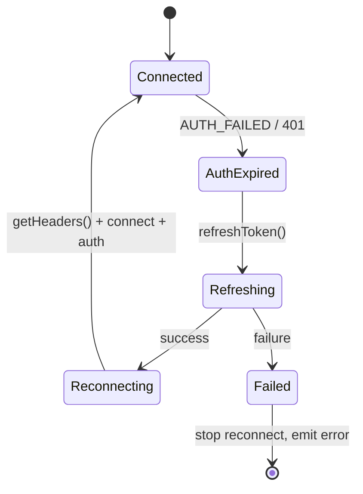

| 步驟 | 行為 |
|------|------|
| 1 | 收到 `AUTH_FAILED` 或 REST 401 → 呼叫 `auth.refreshToken()` |
| 2 | `refreshToken` 成功 → **優雅關閉 WS** → `onDisconnect` |
| 3 | 重新 `connect`；`onConnect('ws')`；可選發送 `auth` / `auth.refresh` |
| 4 | `auth.ok` 後 **resubscribe** 所有 `Subscription` |
| 5 | `refreshToken` 失敗 → **停止自動重連**，`error` 事件 |

**可選 Envelope：`auth.refresh`**

```json
{
  "v": "1.0",
  "id": "c-2",
  "type": "auth.refresh",
  "payload": { "token": "Bearer new-token" }
}
```

回應：`auth.ok`（同 §8.3）。若閘道不支援，則僅用 **斷線重連 + 新 headers**。

### 8.4 訂閱流程

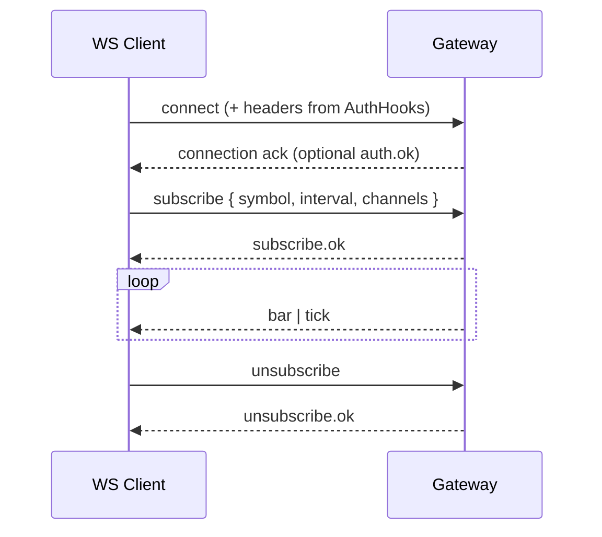

**subscribe**

```json
{
  "v": "1.0",
  "id": "c-10",
  "type": "subscribe",
  "payload": {
    "symbol": "BINANCE:BTCUSDT",
    "interval": "1m",
    "channels": ["bar"],
    "streamMode": "bar"
  }
}
```

| `streamMode` | 說明 |
|--------------|------|
| `bar` | 僅 bar 通道有效（預設） |
| `tick` | 僅 tick + 客戶端聚合 |
| `bar+tick` | bar 權威；tick 輔助（見 §7.2） |

**多圖表單連線**：同一 WS 可承載多個 `subscriptionId`；客戶端維護 `Map<subscriptionId, Subscription>`。

**subscribe.ok**

```json
{
  "v": "1.0",
  "id": "c-10",
  "type": "subscribe.ok",
  "payload": {
    "subscriptionId": "sub-xyz",
    "symbol": "BINANCE:BTCUSDT",
    "interval": "1m"
  }
}
```

**unsubscribe**

```json
{
  "v": "1.0",
  "id": "c-11",
  "type": "unsubscribe",
  "payload": { "subscriptionId": "sub-xyz" }
}
```

### 8.5 即時推送

**bar（更新當前或新 bar）**

```json
{
  "v": "1.0",
  "type": "bar",
  "payload": {
    "subscriptionId": "sub-xyz",
    "bar": { "t": 1710000000000, "o": 1, "h": 2, "l": 0.5, "c": 1.5, "v": 100 },
    "partial": true,
    "barSeq": "18446744073709551615"
  }
}
```

`barSeq`（可選，**`string`**，單調遞增）：用於 reconnect 與 REST 補洞時 **冪等合併**。支援 snowflake / uint64 字串；客戶端以 `compareBarSeq`（§7.1）比較，**不得** 轉為 JS `number`。

**tick**

```json
{
  "v": "1.0",
  "type": "tick",
  "payload": {
    "subscriptionId": "sub-xyz",
    "tick": { "t": 1710000000123, "price": 1.51, "size": 0.01 }
  }
}
```

### 8.6 WS 歷史請求（**mock 必須實作；整合方可選**）

**history.request**

```json
{
  "v": "1.0",
  "id": "c-20",
  "type": "history.request",
  "payload": {
    "symbol": "BINANCE:BTCUSDT",
    "interval": "1h",
    "from": 1700000000000,
    "to": 1710000000000,
    "limit": 5000
  }
}
```

**history.response**

```json
{
  "v": "1.0",
  "id": "c-20",
  "type": "history.response",
  "payload": {
    "bars": [],
    "hasMore": false
  }
}
```

### 8.7 符號搜尋 / 列表

**symbol.search**

```json
{
  "v": "1.0",
  "id": "c-30",
  "type": "symbol.search",
  "payload": { "query": "btc", "limit": 20 }
}
```

**symbol.search.result**

```json
{
  "v": "1.0",
  "id": "c-30",
  "type": "symbol.search.result",
  "payload": {
    "items": [
      {
        "symbol": "BINANCE:BTCUSDT",
        "name": "BTC/USDT",
        "exchange": "BINANCE",
        "type": "crypto",
        "priceScale": 100,
        "minMove": 0.01
      }
    ]
  }
}
```

### 8.8 WS 錯誤碼

| code | 說明 | 客戶端行為 |
|------|------|------------|
| `AUTH_FAILED` | 認證失敗 | 觸發 §8.3.1；刷新失敗才停止重連 |
| `INVALID_MESSAGE` | 格式錯誤 | 記錄，忽略 |
| `UNKNOWN_SYMBOL` | 符號不存在 | 提示 UI，取消訂閱 |
| `SUBSCRIPTION_LIMIT` | 訂閱數超限 | 退避重試或降級 |
| `SERVER_BUSY` | 伺服器繁忙 | 指數退避 |
| `PROTOCOL_MISMATCH` | 版本不符 | 提示升級 |
| `SUBSCRIBE_TIMEOUT` | 訂閱無回應 | 重試後失敗；見 §8.4.1 |

**error 封包**

```json
{
  "v": "1.0",
  "id": "c-10",
  "type": "error",
  "payload": {
    "code": "UNKNOWN_SYMBOL",
    "message": "Symbol not found",
    "refId": "c-10"
  }
}
```

### 8.9 重連策略（框架內建）

| 參數 | 預設值 |
|------|--------|
| 初始延遲 | 500 ms |
| 最大延遲 | 30 s |
| 倍數 | 2（full jitter） |
| 最大嘗試 | ∞（可配置上限） |
| 恢復後 | 自動 `resubscribe` 所有 active subscriptions |
| 心跳 | 客戶端每 25s `ping`，伺服器 `pong`（或 WebSocket 協議層 ping） |

**ping**

```json
{ "v": "1.0", "type": "ping", "ts": 1710000000000 }
```

**pong**

```json
{ "v": "1.0", "type": "pong", "ts": 1710000000000 }
```

斷線期間 bar 由 REST **補洞**（`loadMore` / `range`）對齊最後一根 `t`（詳見 §8.10）。

#### 8.4.1 `subscribe` 超時與重試

| 參數 | 預設 |
|------|------|
| `subscribeAckTimeoutMs` | 10_000 |
| 重試 | 同一 `id` 重送最多 2 次 |
| 失敗 | 回滾為未訂閱；`error` code `SUBSCRIBE_TIMEOUT`；`refId` 對應請求 `id` |

### 8.10 Reconnect reconciliation（重連對賬）

| # | 邊界情況 | 處理 |
|---|----------|------|
| 1 | 斷線時 **partial bar** 未關閉 | 重連後以 `lastBarRef.t` + REST/WS **range(from=lastT, to=now)** 對賬；`partial` 以伺服器為準 |
| 2 | 斷線期間 **symbol/interval 已變** | 丟棄舊 subscription 合併結果；僅處理當前 active `generation` |
| 3 | REST 與 WS **重疊區間** | `compareBarSeq` 大者勝；無 `barSeq` 則 WS 覆蓋 REST |
| 4 | 進行中 **loadMore** | reconnect 開始時 **abort** loadMore；對賬完成後再允許左載 |
| 5 | **cursor** 與 **loadMore** 混用 | 同一 symbol 僅允許 **一種** in-flight history op；gap-fill 用 `capabilities` 選路徑 |
| 6 | 歷史來源 | 若 `capabilities.wsHistory` → `history.request`；否則 REST；**禁止並行**（§6.2） |

**Gap-fill 演算法（摘要）**

```
onReconnect():
  cancel in-flight history
  t0 = lastBarRef.t
  bars = getHistory(range or wsHistory, from=t0, to=now)
  mergeBars(bars) with barSeq rules
  resubscribe all
  if lastBarRef.partial: wait for first post-reconnect bar to close partial
```

### 8.11 協議 v1.1（已決議）

| 項目 | v1.0 | v1.1 |
|------|------|------|
| WS 編碼 | JSON Envelope（§8.1） | **JSON 與 Protobuf 並行** |
| WS 協商 | `X-TradView-Protocol-Version: 1.0` | `1.1` + `Sec-WebSocket-Protocol: tradview-json` **或** `tradview-protobuf` |
| REST body | 扁平 JSON | **強制 Envelope**（§8.2） |
| Protobuf | 無 | `.proto` 與 JSON schema **語義對齊**；`packages/data/proto/` 為單一真相來源 |

**Protobuf 並行規則**

- 同一連線 **僅一種** 編碼；不得在單連線混用 JSON/Protobuf 訊息。
- 客戶端 `DataProvider` 透過 `capabilities.encoding: ('json' \| 'protobuf')[]` 宣告支援；預設 `json`。
- **v1.0 僅實作 JSON**；v1.1 在 PR-02b（見 PR Plan）交付 Protobuf codec，不破壞 v1.0 客戶端。

---

## 9. Pine-lite DSL（v1 範圍）

### 9.1 目標與 v1 交付切分

| 階段 | 交付 | 預設開關 |
|------|------|----------|
| **PR-18a** | Parser + AST + type check + IR 輸出；**plot 為 no-op** | `pineEnabled: false` |
| **PR-18b** | Stack VM + builtins 白名單（sma/ema/rsi…） | dev only |
| **PR-18c** | Worker 沙箱 + 範例腳本；**無** 內建編輯器 UI | **`1.0.0-rc` 可選** `pineEnabled: true` |

**1.0.0 對外承諾（已決議）**：編譯管線存在；**正式版預設 `pineEnabled: false`**；**RC 構建可選開啟執行**（PR-18c）。**不保證** 使用者可見 Pine 編輯器。完整 Pine 相容為 **Non-Goal**。

### 9.2 v1 語法子集（EBNF 摘要）

```
program     := statement*
statement   := decl | assignment | plot_stmt | expr_stmt
decl        := 'var' identifier '=' expr
assignment  := identifier ':=' expr
plot_stmt   := 'plot' '(' expr (',' plot_opts)? ')'
expr        := term (('+'|'-') term)*
term        := factor (('*'|'/') factor)*
factor      := number | identifier | call | '(' expr ')'
call        := identifier '(' arg_list? ')'
builtins    := sma | ema | rsi | macd | crossover | crossunder | highest | lowest
```

**支援類型**：`float`、`series<float>`（與 bar 對齊的序列）。

**不支援（v1）**：`request.security`、多圖表、`strategy`、陣列進階、使用者輸入 UI、`import`。

### 9.3 執行模型

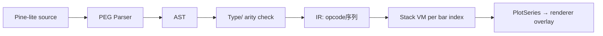

- **逐 bar 執行**：對齊 **`sortedTimes` 全域序列**（非僅可見窗）；可見窗變更 **不** 重置 VM 狀態。
- **Warmup**：Pine 與內建指標共用 §11.6 **`warmupBarCount`**（按 bar 根數，非僅時間跨度）；不足時觸發 `loadMore`。
- **執行環境**：PR-18c 起 **Web Worker** 為預設；PR-18a/b 可主執行緒除錯。

### 9.4 沙箱限制

| 限制項 | 值 |
|--------|-----|
| 原始碼最大長度 | 32 KB |
| 執行時間 / bar | 2 ms（超時中止該 bar） |
| 總執行時間 / 腳本載入 | 200 ms |
| 記憶體 | Worker 內禁止 `importScripts`、無 DOM、無 `fetch` |
| 可用內建函數 | 白名單表（見 `packages/pine-lite/src/builtins.ts`） |
| 變數數量 | ≤ 256 |
| plot 數量 | ≤ 16 |

違規時：`PineError` 事件 + console + toast（**無** v1 編輯器內聯）。

### 9.5 與指標引擎整合

- 內建 MA/MACD 等走 **原生 TypeScript 實作**（效能）。
- Pine-lite 腳本編譯為 `CustomIndicatorDefinition`，輸出 `PlotLine | PlotHistogram | PlotArea`。
- 同一指標窗格可混合「內建 + 自訂」，z-order：主圖疊加 < 副圖。

---

## 10. Rendering Layer — 混合策略

### 10.1 v1 候選 OSS（評估結論）

| 候選 | 技術 | 優點 | 風險 | v1 建議 |
|------|------|------|------|---------|
| **TradingView Lightweight Charts** | Canvas 2D | API 貼近 TV、文檔成熟、K 線效能佳 | 授權 Apache 2.0 需遵守；深度客製軸/多窗格需包裝 | **主圖 + 成交量首選** |
| **PixiJS v8** | WebGL | 精靈批次、濾鏡、文字 | 需自建 K 線幾何與座標系 | 繪圖層 / 高亮 overlay |
| **regl / custom WebGL** | WebGL | 極致效能 | 開發量大 | v2 方向 |
| **uPlot** | Canvas | 極快折線 | K 線蠟燭需自畫 | 僅指標折線備選 |

**v1 決策**：**主序列（蠟燭 + 量 + 指標窗）** 以 **Lightweight Charts（Canvas 2D）** 為底，透過 `@coderyo/renderer-lite` 的 **`PaneOrchestrator`** 統一 `IRenderer`；**繪圖 overlay 預設 Canvas 2D**（Pixi 僅在 PR-06 size gate 通過後啟用，見 §16）。

> **命名澄清**：v1 **不是 WebGL**；`@coderyo/renderer-webgl` 保留給 v2 自研渲染器。

### 10.2 抽象介面（利於 v2 替換）

```typescript
interface ChartTransform {
  timeToX(t: number): number;
  priceToY(price: number, paneId: string): number;
  visibleFromMs: number;
  visibleToMs: number;
  generation: number;
}

interface IRenderer {
  mount(container: HTMLElement, size: Size): void;
  setVisibleRange(range: { fromMs: number; toMs: number }): void;
  /** bars keyed by t; gaps via meta.gaps: number[] */
  setBars(bars: Bar[], meta: RenderMeta): void;
  setOverlays(layers: OverlayLayer[]): void;
  subscribeTransform(cb: (tf: ChartTransform) => void): () => void;
  resize(size: Size): void;
  destroy(): void;
}

interface RenderMeta {
  gaps?: number[];           // bar open times with discontinuity
  gapDisplay?: 'break' | 'connect'; // default 'break' for v1
  lodApplied?: boolean;      // if true, crosshair reads underlying bar via lodSourceMap
}
```

### 10.4 Multi-pane v1 策略（Lightweight Charts）

LWC 本體為 **單圖單實例**；v1 採 **多實例 + 中央協調**，而非單實例硬塞多 pane。

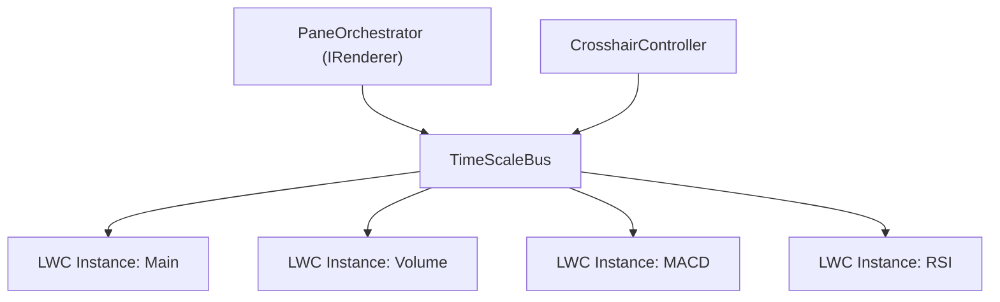

| 元件 | 職責 |
|------|------|
| `PaneOrchestrator` | 實作 `IRenderer`；建立/銷毀 LWC 實例；pane 高度比例 |
| `TimeScaleBus` | 同步 `logicalRange`、scroll、zoom；**單一時間軸真相來源** |
| `CrosshairController` | 一根十字線，事件 fan-out 到各 pane |
| `PaneFactory` | 依 pane 類型建立 series（candlestick / histogram / line） |

**PR-06 驗收（Spike AC）**

- [ ] 主圖 + 成交量 + **至少 1 個指標窗**（MACD 線圖）時間軸對齊誤差 < 1px — **手動/視覺 QA**；自動化僅涵蓋同組 bus（`time-scale-group-sync.test.ts`）、分頁同步解析（`resolve-pane-sync-groups` + `bind-layer-time-scale-sync.test.ts`）
- [x] 同步 pan/zoom 100 次無漂移 — 契約：`TimeScaleBus` 邏輯範圍 100 次同步後 ms 視窗不變（`packages/renderer-lite/tests/time-scale-bus.test.ts`）
- [x] `subscribeTransform` 廣播給 overlay stub — 契約：`TimeScaleBus.subscribeTransform`（`time-scale-bus.test.ts`）+ `ChartController` 訂閱（`time-scale-sync-layers.test.ts` runtime `setPaneSyncGroups`）
- [x] **Bundle size gate**：僅 LWC + core 路徑 **< 180 KB gzip**（不含 ui-shell）— `pnpm check:lwc-size`；CI 缺 artifact 時 `lwc-size-gate.test.ts` 明確失敗

**PR-11 範圍**：在 Orchestrator 上掛載 MACD/RSI/KDJ 獨立 LWC 實例；**禁止** 每指標各自維護獨立 interaction 棧。

### 10.4.1 TimeScaleBus ↔ 毫秒（`logicalRange` 契約）

**Canonical 狀態（唯一真相）**：`{ visibleFromMs, visibleToMs, generation }`，由 `TimeScaleBus` 持有；LWC 的 `logicalRange` 為 **各 pane 的衍生視圖**。

| 步驟 | 規則 |
|------|------|
| ms → slice | `sliceTimes = sortedTimes.filter(t => t >= renderFromMs && t <= renderToMs)`（**僅已載入** bar；不合成假點） |
| slice → logicalRange | 對每個 pane：`logicalFrom = 0`，`logicalTo = sliceTimes.length - 1`（**連續邏輯索引** 對應 slice 內第 0..n-1 根） |
| gaps / whitespace | `meta.gaps` 的 `t` 若在 slice 內，LWC 資料序列插入 **whitespace** 點；各 pane **同一 `sliceTimes` 順序** |
| 使用者 pan/zoom | 從 LWC `timeScale` 反查 **最近** `t` 邊界 → 更新 `visibleFromMs/ToMs` → 再廣播至所有 pane |
| prepend 補償 | 設 `Δ = |{ t_new ∈ sliceTimes after merge }|`；對所有 pane `setVisibleLogicalRange({ from: from+Δ, to: to+Δ })` **同步** |

**稀疏 / 非連續 `sortedTimes`**：logical index 永遠指 **slice 內位置**，不指全域 `sortedTimes` 索引；避免 pane 漂移。

**PR-06 Spike AC（追加）**

- [ ] 在 **marked gap** 兩側已載入段之間 pan，三 pane 時間軸誤差 < 1px — **手動 QA required**；ms→slice 契約見 §10.4.1 + `time-scale-bus.test.ts`（無三 pane 像素 gate）
- [ ] prepend 1000 根後十字線 `t` 不跳變 — 圖表層待補契約測試；資料層見 `packages/series` `mergeBars(prepend)`

### 10.5 LWC 時間軸、缺口與 `setBars`

- LWC 資料點以 **`time: UTCTimestamp`**（秒）或 business day 提交；適配層由 **`t` ms** 轉換。
- **缺口（已決議）**：`meta.gaps` 內的 `t` **不** 插入假 bar；在 LWC 序列插入 **whitespace** 點；各 pane 共用同一 `sliceTimes` 順序。
- **LOD 開啟時**：`lodApplied: true`；十字線圖例顯示 **underlying bar OHLCV** + **「聚合視圖」** 標籤（見 §11.5）。

### 10.3 v2 遷移路徑

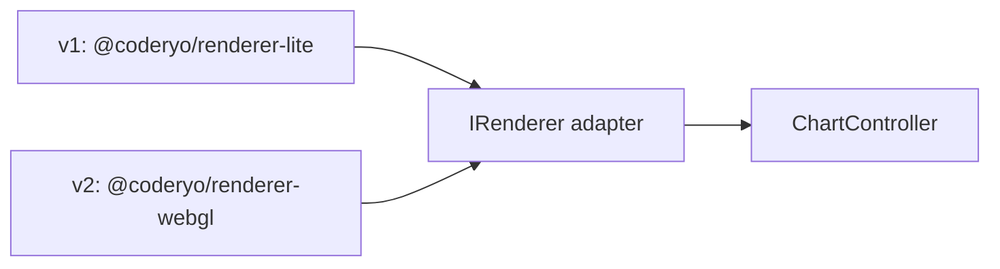

| 階段 | 內容 |
|------|------|
| Phase 0 | 定義 `IRenderer`，所有座標/刻度計算抽到 `@coderyo/series` |
| Phase 1 | 自研蠟燭幾何著色器（單 draw call batch） |
| Phase 2 | 統一軸、十字線、多 pane 同步 |
| Phase 3 | 移除 Lightweight Charts 依賴，體積目標 CDN < 180 KB gzip |

**Feature flag**：`options.renderer = 'lite' | 'webgl'`（預設 `lite`）。

---

## 11. Virtual Window / Data Windowing（虛擬視窗演算法）

### 11.1 問題陳述

- 總 bar 數 **無上限**（理論 `N → ∞`）。
- 記憶體僅保留 **已載入** 時間區間；`loadedRanges` **可不連續**。
- 渲染僅繪製 **`[renderFromMs, renderToMs]`**（可見 + buffer），**主鍵一律為 `t`**。

### 11.2 核心概念（時間優先）

| 名稱 | 定義 |
|------|------|
| `visibleFromMs` / `visibleToMs` | 由 TimeScaleBus / viewport 決定 |
| `bufferMs` | 左右各加 `max(0.1 * span, 50 * intervalMs)` |
| `renderFromMs` / `renderToMs` | visible ± buffer |
| `loadedRanges` | 已載入的 **時間** 區間並集（可非連續） |
| `fetchThreshold` | 距已載入邊界 < `20 * intervalMs` 時觸發補載（見下） |
| `fetchPolicy` | **`lazy-left-only`（v1 預設）** 或 `fill-visible-holes`（pan 至可見區內未載入洞時主動補載） |

**禁止**：以全域陣列 index 作為 crosshair / bridge / drawings 的穩定識別。

### 11.3 演算法大綱（偽代碼）

```
onVisibleRangeChanged(viewport):
  visibleFromMs, visibleToMs = viewport
  renderFromMs = visibleFromMs - bufferMs(...)
  renderToMs = visibleToMs + bufferMs(...)

  // --- History fetch (mutationQueue) ---
  if needsHistoryLeft(renderFromMs):
    enqueue loadMore(endTime = minLoadedOpenTime - intervalMs, PAGE_SIZE)

  if fetchPolicy == 'fill-visible-holes':
    for hole in findHoles(renderFromMs, renderToMs, loadedRanges):
      enqueue fillRange(hole.fromMs, hole.toMs)  // prefers mode: range

    if needsHistoryRight(renderToMs):
      enqueue getHistory(range: { from: maxLoadedToMs + intervalMs, to: renderToMs })
        or loadMore(endTime = renderToMs, limit) toward right edge

  else:  // lazy-left-only
    // no interior/right fetch; UI shows gap markers only (§7.3)

  await drainMutationQueue()  // single commit frame

  slice = bars where t in [renderFromMs, renderToMs]
  gaps = detectGaps(slice)   // calendar/session holes in data
  renderBars = lodSelect(slice) ...
  renderer.setBars(renderBars, { gaps, ... })
  TimeScaleBus.syncLogicalRanges(sliceTimes)  // §10.4.1

  ensureWarmupBars(visibleFromMs)           // §11.6; may enqueue more loadMore
  indicators.recompute(...)
  drawings.applyTransform(subscribeTransform)
```

**`findHoles(a, b, loadedRanges)`**

- 將 `loadedRanges` 與 `[a,b]` 交集後排序；相鄰段若 `prev.toMs + intervalMs < next.fromMs` → 洞 `{ fromMs, toMs }`。
- 使用者 pan/zoom 進入 **兩段已載入資料之間的空白** 時，`fill-visible-holes` 以 **`range` 請求** 填洞（若 capabilities 不支援 `range`，退化為多次 `loadMore` 由右向左逼近）。

**`needsHistoryLeft` / `needsHistoryRight`**

| 函式 | 為真條件 |
|------|----------|
| `needsHistoryLeft` | `renderFromMs` 小於當前已載入最小 `fromMs`（或距左緣 < `fetchThreshold`） |
| `needsHistoryRight` | `renderToMs` 大於當前已載入最大 `toMs`（且非僅靠 realtime 追價） |

**`loadMore` / `fillRange` 完成後**

- **不改變** `visibleFromMs/visibleToMs`。
- `TimeScaleBus` prepend **logicalRange 偏移**（§10.4.1），非僅 `barSpacing × Δt` 估算。

### 11.4 記憶體裁剪（可選配置）

- `maxBarsInMemory` 預設 **200_000**。
- 裁剪時：保留 `visibleFromMs` 左側至少 **`warmupBarCount`** 根（§11.6）；刪除更左與 `t > visibleToMs + forwardBuffer` 的遠端條目。
- **保留** `loadedRanges` 元資料（即使該段已被裁掉）以便再次 `loadMore`。
- 內建指標使用 **增量狀態**（EMA 等）+ §11.6 warmup；**禁止** 僅在可見窗上重算卻無前置狀態。

### 11.5 LOD（Level of Detail）— **僅渲染副本**

| 可見 bar 數（slice 內） | 行為 |
|-------------------------|------|
| ≤ 2000 | 每根蠟燭完整描邊 |
| 2000–8000 | 簡化描邊，僅 fill |
| > 8000 | **像素柱**聚合：`pixelColumn[x] = { min, max, open, close }` |

- LOD **不寫入** `BarStore`；`lodSourceMap` 將聚合點映射回代表 `t`（用於十字線）。
- 十字線圖例：預設顯示 **underlying bar** OHLCV；`lodApplied` 時可選顯示「聚合」標籤。

### 11.6 Warmup / `indicatorLookback`（與 Pine 共用）

| 指標 | `lookbackBars`（建議預設） |
|------|---------------------------|
| SMA(n) | `n` |
| MACD(12,26,9) | `26 + 9 + buffer(10)` |
| RSI(14) | `14 + buffer(10)` |
| KDJ(9,3,3) | `9 + buffer(20)` |
| Vol MA | `n` |
| Pine 腳本 | `max(builtinLookback, userDeclLookback)` 靜態分析 |

```
warmupBarCount = max(lookbackBars) over active indicators
warmupMs = warmupBarCount * intervalMs   // hint for fetch scheduling only
```

**保留規則（bar 根數優先於時間）**

1. 自 `visibleFromMs` 沿 `sortedTimes` **向左** 至少保留 **`warmupBarCount` 個實際 bar**（跳過 calendar gap 不計入根數）。
2. 若不足 → `ensureWarmupBars()` 觸發 **`loadMore` / `fillRange`** 直至滿足或達 `maxHistoryFetch`。
3. 記憶體裁剪：**不得** 刪除上述 warmup 條目；`warmupMs` 僅作排程提示，**不作** 唯一判據（避免 session gap 導致 bar 不足）。

**驗收（PR-05 / PR-10）**

- 左拖動 `loadMore` 後，MA/MACD 與全量載入對照誤差 < 1e-8。
- **Gapped fixture**（halt 週末）：warmup 仍滿足 `warmupBarCount` 根實 bar，指標無跳變。
- 記憶體 trim 後，可見區左緣指標 **不** 出現跳變。

---

## 12. UI Component Breakdown（TV 式版面拆解）

```
┌─────────────────────────────────────────────────────────────────┐
│ TopBar: LogoSlot | SymbolSearch | IntervalSelector | ChartActions│
├────┬────────────────────────────────────────────────────────────┤
│ L  │ MainPaneArea                                                │
│ e  │  ┌──────────────────────────────────────┬───────────────┐ │
│ f  │  │ MainChart (candles + overlays)       │ PriceScale    │ │
│ t  │  │                                      │ (right)       │ │
│ T  │  ├──────────────────────────────────────┤               │ │
│ o  │  │ VolumePane                           │               │ │
│ o  │  ├──────────────────────────────────────┤               │ │
│ l  │  │ IndicatorPane(s) e.g. MACD, RSI      │               │ │
│ b  │  └──────────────────────────────────────┴───────────────┘ │
│ a  │ TimeScale (bottom, shared)                                    │
│ r  ├─────────────────────────────────────────────────────────────┤
│    │ StatusBar: OHLCV legend | Connection | Locale              │
└────┴─────────────────────────────────────────────────────────────┘
     Floating: CrosshairLegend, ContextMenu, DrawingToolbar
```

### 12.1 元件清單（`@coderyo/ui-shell`）

| 元件 ID | 職責 |
|---------|------|
| `ChartLayout` | CSS Grid 根布局；**v1 支援 pane 高度拖曳**（OQ1） |
| `TopBar` | 週期、品種、主題、**全螢幕**、**截圖** |
| `LeftToolbar` | 游標、趨勢線、斐波那契、文字、測量（測量 v1.1） |
| `SymbolSearchDialog` | `searchSymbols` → `SymbolResolver.resolve` 豐富化（§6.3） |
| `IntervalSelector` | 支援自訂 interval 列表 |
| `MainChartPane` | 綁定 `IRenderer` 主圖 |
| `VolumePane` | 副圖量柱 |
| `IndicatorPaneHost` | 動態新增 MACD/RSI 等窗格 |
| `PriceScale` | 價格格式化；**v1 支援線性 / 對數**（`scaleMode`，OQ3） |
| `TimeScale` | 統一時間軸、與所有 pane 同步 |
| `CrosshairController` | 十字線 + OHLCV 圖例 |
| `IndicatorSettingsPanel` | 參數表單（週期、源字段 close/hlc3） |
| `DrawingLayer` | Canvas overlay（預設）；訂閱 `subscribeTransform`（§10.2） |
| `ThemeProvider` | CSS variables dark/light（`@coderyo/ui-shell` `createThemeProvider` + `localStorage`） |
| `I18nProvider` | `t('key')` + 動態載入語言包；**預設 locale `zh-TW`**（`createI18nProvider` 包裝 `@coderyo/i18n`） |
| `LogoSlot` | TopBar 品牌區（`mountLogoSlot`） |
| `SymbolSearchDialog` | 彈窗式搜尋（`createSymbolSearchDialog`；TopBar `symbolInput: 'dialog'`） |

### 12.2 互動狀態機（簡化）

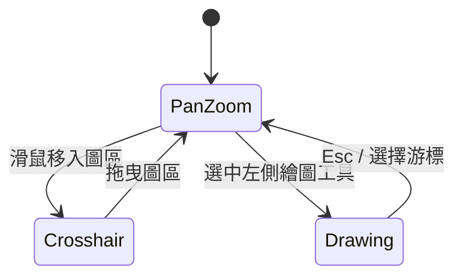

---

## 13. WebView Integration Guide（WebView 整合指南）

### 13.1 嵌入方式

```html
<div id="chart" style="width:100%;height:100%"></div>
<script src="https://cdn.example.com/tradview.min.js"></script>
<script>
  const chart = TradView.createChart('#chart', {
    dataProvider: myProvider,
    symbolResolver: myResolver,
    bridge: TradView.createDefaultBridge({ target: window })
  });
</script>
```

### 13.2 postMessage 契約

**Web → Native（`BridgeEvent`）**

| type | payload 要點 |
|------|----------------|
| `chart.ready` | `chartId`, `bridgeSchemaVersion`, `apiVersion` |
| `chart.resize` | `width`, `height` |
| `chart.connectionChange` | `state` |
| `chart.destroyed` | `chartId` |
| `chart.crosshair` | `time`, `price`, `ohlcv`, `symbol`, `interval` |
| `chart.interval` | `interval` |
| `chart.symbol` | `symbol` |
| `chart.visibleRange` | `from`, `to`（ms） |
| `chart.error` | `code`, `message` |

**Native → Web（`BridgeInbound`）**

| type | 行為 |
|------|------|
| `host.setSymbol` | 等同 `chart.setSymbol` |
| `host.setInterval` | 等同 `chart.setInterval` |
| `host.setTheme` | 切換主題 |
| `host.fitContent` | 適應內容 |
| `host.scrollToRealtime` | 滾動至最新 |
| `host.resize` | 觸發 `chart.resize()` |
| `host.destroy` | 銷毀圖表實例 |

### 13.3 安全建議

```typescript
// 原生側只接受可信 origin
window.addEventListener('message', (e) => {
  if (e.origin !== 'https://app.example.com') return;
  if (typeof e.data?.type !== 'string') return;
  bridge.dispatch(e.data);
});
```

**H5 側**：`bridge.post` 使用 `window.ReactNativeWebView?.postMessage` / `webkit.messageHandlers.tradview.postMessage` 適配。

### 13.4 尺寸與生命週期

- 容器 **必須** 有明確高度；監聽 `ResizeObserver` 觸發 `chart.resize()`。
- WebView 從背景恢復：觸發 `visibilitychange` → WS reconnect + visible range 校準。

---

## 14. localStorage Schema — Drawings（繪圖持久化）

**Key 命名**：`tradview:drawings:{chartInstanceId}:{symbol}:{interval}`

```json
{
  "version": 1,
  "updatedAt": 1710000000000,
  "drawings": [
    {
      "id": "uuid",
      "type": "trendLine",
      "points": [
        { "time": 1710000000000, "price": 100.5 },
        { "time": 1710086400000, "price": 105.2 }
      ],
      "style": {
        "color": "#2962FF",
        "lineWidth": 1,
        "lineStyle": "solid"
      },
      "locked": false,
      "visible": true
    }
  ]
}
```

| type | points 規則 |
|------|-------------|
| `trendLine` | 2 點 |
| `horizontalLine` | 1 點（price） |
| `verticalLine` | 1 點（time） |
| `rectangle` | 2 對角點 |
| `fibonacci` | 2 點 + `levels: number[]` 預設 `[0,0.236,0.382,0.5,0.618,1]` |
| `text` | 1 點 + `text: string` |

**遷移**：`version` 不符時備份舊 key 並清空或執行遷移器。

**容量**：單 key 建議 < 512 KB；超出時 LRU 刪除最舊 `id` 並提示。

---

## 15. Latency / Performance Targets（效能目標）

| 指標 | 目標（p95） | 量測條件 |
|------|-------------|----------|
| 首屏可互動（TTI） | < 1.5 s | 載入 5k 根歷史 + 1080p |
| 縮放/平移幀率 | ≥ 55 fps | 可見 500 根，Mid 手機 WebView |
| 十字線移動延遲 | < 16 ms | 桌面 Chrome |
| WS bar → 上屏 | < 100 ms | 含合併與單次 render |
| `loadMore` 追加 2k 根 | < 300 ms | 含 merge + 增量指標 |
| 記憶體（10 萬根已載入） | < 120 MB | Chrome heap 近似 |
| CDN 包體積 | **< 400 KB gzip** | v1 含 UI shell（已決議） |
| LWC 核心路徑 | **< 180 KB gzip** | PR-06 gate（已決議） |
| Pine 腳本載入 | < 200 ms | 1k 行級別子集 |

---

## 16. Alternatives Considered（曾考慮的替代方案）

| 方案 | 放棄原因 |
|------|----------|
| 直接 iframe TradingView Widget | 授權與資料不可控 |
| 全自研 v1 WebGL | 工期過長，無法滿足 A 優先 |
| React 為核心 | 限制嵌入場景，違反「框架無關」 |
| 僅 Canvas 2D 不用 OSS | 重複造輪，軸與縮放成熟度高 |
| IndexedDB 存繪圖 v1 | 複雜度過高；localStorage 足夠 v1 |
| **LWC 單實例扛全部 pane** | 無法對齊 TV 多窗格指標；改 **PaneOrchestrator + 多 LWC**（§10.4） |
| **Pixi 作為預設繪圖引擎** | bundle 超預算風險；v1 預設 **Canvas overlay**，Pixi 為 gated optional（§15、PR-06） |
| **v1 完整 Pine 編輯器 + 執行** | 工期與安全面過大；v1 **compile-only 預設關閉**，執行拆 PR-18a–c（§9） |
| **僅內建指標、無 Pine** | 保留為時程極緊時的 **降級開關**（`pineEnabled: false` 已預設） |

---

## 17. Security（安全）

| 面向 | 措施 |
|------|------|
| 認證 | 框架不存 token；僅 `AuthHooks` 回調 |
| WS/REST | 強制 HTTPS/WSS；整合方 CORS/閘道 |
| Pine-lite | Worker 沙箱、無網路、超時終止 |
| postMessage | 驗證 `origin`、schema 校驗、忽略未知 type |
| XSS | 不使用 `innerHTML` 渲染使用者腳本；文字繪圖 escape |
| 供應鏈 | lockfile、OSS 授權審計（Apache/MIT） |

---

## 18. Observability（可觀測性）

| 機制 | 說明 |
|------|------|
| `debug` 模式 | 顯示 FPS、`visibleFromMs`/`visibleToMs`、`renderFromMs`/`renderToMs`、`generation`、`loadedRanges` 段數、WS 狀態 overlay |
| 結構化日誌 | `logger` 介面：`trace|info|warn|error`，可接 Sentry |
| 指標鉤子 | `ChartOptions.telemetry.onMetric`（§6.1）例如 `ws.reconnect`, `render.ms` |
| 錯誤邊界 | 渲染異常降級為靜態提示，不白屏 |

---

## 19. Rollout（發布計畫）

| 里程碑 | 內容 | 預估 |
|--------|------|------|
| M0 | Monorepo 腳手架 + CI + playground | 第 1–2 週 |
| M1 | **B**：資料層 + mock + **Minimal Chart Slice**（PR-02–07, PR-06b）+ **bundle size gate** | 第 3–5 週 |
| M2 | **A**：完整 UI shell + 多 pane 指標 + 虛擬視窗強化 | 第 6–9 週 |
| M3 | 繪圖 + Pine-lite（18a–c）+ Bridge + i18n | 第 10–12 週 |
| M4 | CDN/npm RC（API freeze）、效能調優 | 第 13–14 週 |

**語意化版本**：`0.x` 為 breaking 可能期；`1.0.0` 凍結公開 API 與協議 1.0。

---

## 20. Decision Log（決策登錄簿 — 全部已關閉）

> **狀態**：無待決 Open Questions。以下為最終規格，實作不得偏離；若需變更須走 ADR 修訂本文件。

| ID | 決策 | 最終選擇 | 關聯章節 / PR |
|----|------|----------|---------------|
| OQ1 | 多 pane 高度拖曳 | **v1 要** + `localStorage` 比例 | §12、PR-09 |
| OQ2 | WS Protobuf | **v1.1 與 JSON 並行**（subprotocol 協商） | §8.11、PR-02b |
| OQ3 | 對數價格軸 | **v1 必須** | §12、PR-06/08 |
| OQ4 | Pixi 繪圖 | **僅 PR-06 gate 通過** | §10、PR-06/16 |
| OQ5 | 授權模型 | **core 等 MIT 開源；ui-shell + drawings 私有** | §1、§5.2 |
| D06 | REST v1.1 Envelope | **v1.1 強制 Envelope**；v1.0 扁平 | §8.2 |
| D07 | Monorepo | **pnpm + Turborepo** | §5 |
| D08 | LWC 缺口 | **whitespace** | §10.5 |
| D09 | LWC 時間 | **UTCTimestamp 秒**（由 `t` ms 轉換） | §10.5 |
| D10 | BarStore 快取 | **LRU 最多 5 個** key | §7 |
| D11 | Pine 執行 | **1.0.0-rc 可選** `pineEnabled`；正式版預設關 | §9、PR-18c |
| D12 | WS 歷史 | **mock 必須**；整合方可選 | §8.6、PR-02 |
| D13 | LOD 圖例 | **underlying +「聚合視圖」標籤** | §10.5、§11.5 |
| D14 | i18n 預設 | **`zh-TW`** | §6、PR-13 |
| D15 | fetchPolicy | **預設 `lazy-left-only`**；可選 `fill-visible-holes` | §11.3 |
| D16 | npm 發布 | **所有 packages 可獨立發布** | §5.2 |
| D17 | CDN gzip 上限 | **400 KB**（含 ui-shell） | §15、PR-19 |
| D18 | LWC gzip 上限 | **180 KB** | PR-06 |
| D19 | 全螢幕 | **v1 TopBar + `setFullscreen`** | §6、PR-09 |
| D20 | 截圖 PNG | **v1 `exportImage` + TopBar** | §6、PR-09 |

---

## 21. References（參考）

- [TradingView Lightweight Charts](https://github.com/tradingview/lightweight-charts) — Apache 2.0
- [PixiJS](https://pixijs.com/)
- TradingView 公開 UX（僅作互動參考，無程式碼依賴）
- [WebView postMessage MDN](https://developer.mozilla.org/en-US/docs/Web/API/Window/postMessage)

---

## Key Decisions — 關鍵架構決策摘要

| 決策 | 選擇 | 理由 |
|------|------|------|
| 產品形態 | 可嵌入元件，非終端 | 降低範圍，聚焦圖表與資料抽象 |
| 技術棧 | TS 原生 + WebView 統一 bundle | 最大嵌入性，宿主自選框架 |
| 渲染 v1 | **`@coderyo/renderer-lite`（LWC Canvas 2D）** + Canvas overlay | v1 **非 WebGL**；最快達 TV 級 K 線 |
| 多 pane v1 | **PaneOrchestrator + N×LWC + TimeScaleBus** | LWC 單實例無法原生多窗格（§10.4） |
| 渲染 v2 | **`@coderyo/renderer-webgl`** 自研 WebGL | 體積、深度客製、統一 pane |
| 資料 | REST + WS JSON v1；`barSeq` **string** 冪等 | 避免 JS Number 精度問題 |
| 歷史補載 | v1 預設 **`lazy-left-only`**；可選 **`fill-visible-holes`** | 省流量 vs 主動補洞（§11.3、D15） |
| 授權 | **core MIT 開源；ui-shell/drawings 私有** | 商業分層（OQ5） |
| 協議 v1.1 | REST Envelope 強制 + WS Protobuf 並行 | §8.11 |
| npm | **全 packages 可發布** | 整合方可按需依賴子包 |
| Bundle | CDN **400KB**；LWC 路徑 **180KB** gzip | PR-06/19 gate |
| 全螢幕/截圖 | v1 TopBar + API | G11 |
| 分頁 | `DataProviderCapabilities` + fallback 順序 | 後端只實作子集時仍可運作 |
| 認證 | hooks + §8.3.1 重連刷新 | 長連線 JWT 旋轉 |
| 虛擬視窗 | **`t` 主鍵** + `warmupBarCount` + mutationQueue | 避免 index 漂移；gap 日曆下指標仍正確 |
| TimeScaleBus | **ms canonical** → per-pane `logicalRange` | 稀疏 bar 與多 LWC 對齊（§10.4.1） |
| realtime | 預設 `streamMode: bar` | 避免 bar+tick 雙寫 |
| Pine v1 | **compile-only，預設關閉**；PR-18a–c 拆分 | 工期可預測；1.0 不承諾編輯器 |
| 繪圖 | Canvas overlay 預設；Pixi gated | PR-06 bundle gate 決定 |
| 優先級 | **驗收：A > B > 繪圖**；**實作：B 垂直切片 → A（M2）** | 有文件記載的 intentional reorder |
| API 凍結 | **RC（PR-19）** 非 PR-07 | PR-07 僅 minimal embed API |
| 交付 | npm + CDN；**PR-06/19 size gate** | 提早暴露 bundle 風險 |

---

## PR Plan — 增量 PR 計畫

> 綠地倉庫，每個 PR 可獨立 review。  
> **主幹（Main spine）**：PR-01 → … → PR-09（B 資料與渲染垂直切片 + M1 最小 UI）→ PR-10–11（指標）→ PR-19（RC freeze）。  
> **並行軌（Parallel tracks）**：PR-12/13/14/15 可於 PR-09 後並行，但 **RC 前建議順序**：10 → 11 → 12 → 13 → 15 → 16。

### 優先級對照（回應 review Issue 5）

| 維度 | 順序 | 對應 PR |
|------|------|---------|
| 產品驗收優先級 | A > B > 繪圖 | M2=PR-09；M1=B+PR-06b |
| 工程合併順序 | B → 渲染 → 互動 → A 完整殼層 | PR-02–08, PR-06b, PR-09 |

---

### PR-01: `chore: monorepo scaffold and toolchain`
- **範圍**：pnpm workspace、turbo、eslint/tsconfig、CI
- **依賴**：無

### PR-02: `feat(protocol): Interval registry, REST/WS types, mock gateway`
- **範圍**：§8.0 `INTERVAL_REGISTRY`、`DataProviderCapabilities`、`GET /capabilities`、`barSeq` **string**、三種 history mock、**§8.6 `history.request/response`（mock 必須）**
- **依賴**：PR-01
- **驗收**：mock 支援 range/cursor/loadMore + wsHistory；`compareBarSeq` 單測（uint64 字串）

### PR-02b: `feat(protocol): v1.1 Protobuf codec + REST Envelope`（M3 前可選合併）
- **範圍**：§8.11 `.proto`、`tradview-protobuf` subprotocol、REST v1.1 Envelope 適配器
- **依賴**：PR-02
- **驗收**：JSON 與 Protobuf 同一語義 golden test；不破壞 v1.0 客戶端

### PR-03: `feat(data): clients, reconnect, auth refresh, subscribe timeout`
- **範圍**：§8.3.1、§8.4.1、§8.10 客戶端骨架、`Subscription` 型別
- **依賴**：PR-02
- **驗收**：整合測試覆蓋 reconnect + `refreshToken` + subscribe 超時（`packages/data/tests/ws-client.test.ts`、`ws-client.reconnect.test.ts`、`gateway-provider.integration.test.ts`）
- **狀態**：**v1 已實作**

### PR-04: `feat(series): BarStore time-key, mutationQueue, tick modes`
- **範圍**：§7.1–7.4、`barSeq: string` + `compareBarSeq`、`streamMode`、symbol/interval 切換
- **依賴**：PR-03
- **驗收**：並發 loadMore + WS；大整數 `barSeq` 合併測試

### PR-05: `feat(virtual-window): time-range window, hole fill, warmup, invariants`
- **範圍**：§11.3 雙 `fetchPolicy`（**預設 lazy-left-only** + 可選 fill-visible-holes）；`findHoles` / `needsHistoryRight`；§11.6 `warmupBarCount`
- **依賴**：PR-04
- **驗收**：`fill-visible-holes` 下 pan 進中間洞可補載；`lazy-left-only` 下僅左緣 loadMore；gapped warmup fixture

### PR-06: `feat(renderer-lite): PaneOrchestrator, LWC main+volume, transform bus`
- **範圍**：`packages/renderer-lite`、§10.4、§10.4.1、§10.5、`subscribeTransform`、**對數價格軸（OQ3）**
- **依賴**：PR-05
- **驗收**：§10.4 + §10.4.1 Spike AC；**size-limit：LWC 路徑 < 180KB gzip**
- **繪圖**：overlay **stub**（空 Canvas + transform 訂閱）；Pixi 僅在 gate 通過時啟用（OQ4）

### PR-06b: `feat(ui-chrome-minimal): TopBar + IntervalSelector stub (M1 demo)`
- **範圍**：最小 **A 展示**：週期列 + 容器 chrome，無 LeftToolbar
- **依賴**：PR-06
- **說明**：**M1 即可對外 demo**（B + 最小 A），不阻塞 PR-09 完整殼層

### PR-07: `feat(core): createChart minimal embed API`
- **範圍**：`apiVersion`、`telemetry`、`IChart.resize`、`ConnectionState`/`DataError`（§6.7）、`fetchPolicy`；**不宣稱 API freeze**
- **依賴**：PR-06b
- **驗收**：`ResizeObserver` → `resize()` → bridge `chart.resize`

### PR-08: `feat(interaction): pan, zoom, crosshair via TimeScaleBus`
- **範圍**：與 Orchestrator 單一 interaction 棧
- **依賴**：PR-07

### PR-09: `feat(ui-shell): full TV layout (A — M2)`
- **範圍**：LeftToolbar 殼、IndicatorPaneHost、**pane 拖曳（OQ1）**、**全螢幕 + 截圖（D19/D20）**、`setFullscreen`/`exportImage` 接線、主題
- **依賴**：PR-08
- **說明**：**完整 A**；`@coderyo/ui-shell` 為 **UNLICENSED** 私有包
- **狀態**：**v1 已實作**（主圖/量 `attachPaneResizer`；指標窗 MACD/RSI/KDJ 拖曳在 `renderer-lite`；`ThemeProvider`/`I18nProvider`/`LogoSlot`/`SymbolSearchDialog`）

### PR-10: `feat(indicators): MA, Vol MA + warmup integration`
- **依賴**：PR-09
- **驗收**：§11.6 對照測試

### PR-11: `feat(indicators): MACD, RSI, KDJ multi-pane LWC instances`
- **範圍**：§10.4 指標窗；Parameter panel
- **依賴**：PR-10

### PR-12: `feat(symbol): resolve flow, search, switch lifecycle`（parallel track）
- **依賴**：PR-09
- **建議合併於**：PR-11 之後（需穩定 pane）

### PR-13: `feat(i18n): plugin`（parallel track）
- **依賴**：PR-09

### PR-14: `feat(keyboard): shortcuts`（parallel track）
- **依賴**：PR-08

### PR-15: `feat(bridge): extended postMessage contract`（parallel track）
- **依賴**：PR-07

### PR-16: `feat(drawings): Canvas overlay + hit-test`（可略晚）
- **依賴**：PR-06 `subscribeTransform`、PR-09
- **Spike**：若 PR-06 gate 失敗，**禁止** Pixi；Canvas-only

### PR-17: `feat(storage): drawing localStorage v1`
- **依賴**：PR-16

### PR-18a: `feat(pine-lite): parser, checker, IR, noop plots`
- **依賴**：PR-11
- **預設**：`pineEnabled: false`

### PR-18b: `feat(pine-lite): stack VM + builtins`
- **依賴**：PR-18a

### PR-18c: `feat(pine-lite): Worker sandbox + sample scripts`
- **依賴**：PR-18b

### PR-19: `build(cdn): UMD bundle + **public API freeze** + full size budget`
- **範圍**：含 ui-shell 目標 **< 400KB gzip**；`apiVersion` 凍結
- **依賴**：PR-07–13 主幹合併後（可不含 16–18）
- **說明**：**提前於原 PR-19 時點的商業要求**，在 RC 前強制 gate

### PR-20: `docs: protocol + embedding site`
- **依賴**：PR-02、PR-15

### PR-21: `perf: LOD render copy + indicator incremental`
- **依賴**：PR-05、PR-11
- **說明**：§11.5 完整 LOD + `lodSourceMap`
- **狀態**：**v1 部分**（`lodDecimateBars` 於 Orchestrator；指標窗 `detectIndicatorBarMutation` + `series.update` 尾端增量）

### PR-22: `feat(renderer-webgl): v2 stub + feature flag`
- **範圍**：`packages/renderer-webgl` 空實作
- **依賴**：PR-06

---

## v1.0 實作對照（TradView 1.0.x）

| 能力 | 套件 | 備註 |
|------|------|------|
| TV 殼層 TopBar / LeftToolbar / 設定 | `@coderyo/ui-shell` | 含全螢幕、截圖、主題、品種搜尋（inline / dialog） |
| 主圖 + 量 + 指標窗高度拖曳 | `@coderyo/renderer-lite` | `tradview:pane:*` localStorage 比例 |
| 資料客戶端重連 / 訂閱超時 / token 刷新 | `@coderyo/data` | `TradViewWsClient` |
| 指標 MACD / RSI / KDJ | `@coderyo/indicators` + renderer-lite | 可關閉窗格 |
| 週期切換僅調 bar spacing | `@coderyo/core` | 可見根數由整合方 `getHistory` 決定 |

**明確不在 v1**：Protobuf v1.1、CDN 授權 gate、完整 Pine v5、`renderer-webgl` 實作、TradingView 資料源。

---

*文件結束 — v1.0-spec（決策已全部關閉）*